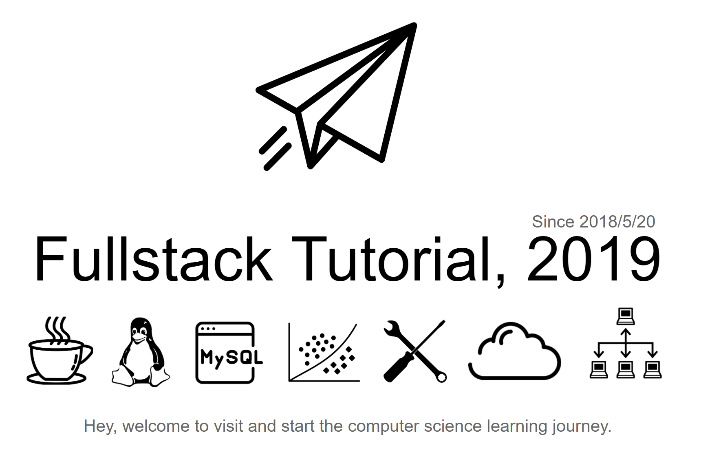

  

|              I              |           II           |           III           |           IV           |            V            |            VI            |        VII        |         VIII         | IX |            X            |            XI            |            XII            |
| :--------------------------: | :-------------------: | :----------------------: | :---------------------: | :--------------: | :---------------: | :----------------------: | :----------------------: | :----------------------: | :----------------------: | :----------------------: | :----------------------: |
| 算法 [📝](#一数据结构与算法) | Java [☕️](#二java) | Python [🐍](#三python) | 前端 [🔗](#四前端) | 数据库 [💾](#五数据库) | 操作系统 [💻](#六操作系统) | 网络通信 [☁️](#七网络通信) | 分布式 [📃](#八分布式) | 机器学习  [🔍](#九机器学习) |工具 [🔨](#十工具) |Learn [📖](#learn-) |Talking [💡](#talking-bulb) |

  
    

        📢📢📢
    

    

 		和技术达人们一起交流：
        <a href="notes/技术交流群.md">QQ技术交流群</a>
    

    

        欢迎志同道合的小伙伴加入开源小组：<a href="notes/开源贡献.md">⊱ 开源小组，英雄招募令</a>
    

    

         
        

            🔥🔥🔥
        

        

             为极客打造，阅读体验更好的在线文档（与 GitHub 实时同步）
        

        

            支持手机阅读，目录导航，Gitalk 评论，搜索定位
        

        

            📖 <a href="https://frank-lam.github.io/fullstack-tutorial/#/">点击，即刻开始阅读！</a>
        

    

        

         
        

            🔥🔥🔥
        

        

             也许你特别钟爱 GitHub 的阅读体验，没关系
        

        

            我也为您打造了一款 Chrome 插件 <a href="https://github.com/fullstack-tutorial/github-markdown-toc">Chrome Extension：GitHub Markdown</a>
        

        

            方便在 GitHub 长文阅读时，在侧边栏生成标题目录定位
            

        

            🎅 特别鸣谢共同完成两位小伙伴：<a href="https://github.com/dxiaoqi">@dxiaoqi</a> <a href="https://github.com/dzeze">@dzeze</a>
    

## 前言

- [全栈修炼手册：如何选择自己的技术栈？](notes/如何选择自己的技术栈.md)

  在编程的世界里，该如何选择自己的技术栈呢。学前端？学 APP 开发？对于 Java、C++、C#、Python、PHP 又如何选择呢？人工智能现如今这么火，是不是机器学习、深度学习更高级一些呢？那么程序员又如何修炼内功呢？

- [全栈开发神兵利器](notes/全栈开发神兵利器.md)

  工欲善其事，必先利其器。这里我将推荐开发过程中的提效工具、开发利器、协作工具、文档技术等等。

- [XP 极限编程](notes/XP极限编程.md)

  敏捷软件开发中可能是最富有成效的几种方法学之一

## 技能图谱

- [backend skill](notes/SkillTree/backend-skill.md)

  后台开发技能图谱，从程序员的内功修炼到后台语言，分布式系统架构

## 一、数据结构与算法

- [数据结构与算法](notes/数据结构与算法.md)

　　排序算法、动态规划、递归、回溯法、贪心算法等

- [海量数据处理](notes/海量数据处理.md)

  数据处理典型案例，逐渐更新

## 二、Java

- [Java 基础概念](notes/JavaArchitecture/01-Java基础.md)

　　基本概念、面向对象、关键字、基本数据类型与运算、字符串与数组、异常处理、Object 通用方法

- [Java 集合框架](notes/JavaArchitecture/02-Java集合框架.md)

　　数据结构 & 源码分析：ArrayList、Vector、LinkedList、HashMap、ConcurrentHashMap、HashSet、LinkedHashSet and LinkedHashMap

- [Java 并发编程](notes/JavaArchitecture/03-Java并发编程.md)

　　线程状态、线程机制、线程通信、J.U.C 组件、JMM、线程安全、锁优化

- [Java I/O](notes/JavaArchitecture/04-Java-IO.md)

　　磁盘操作、字节操作、字符操作、对象操作、网络操作、NIO

- [Java 虚拟机](notes/JavaArchitecture/05-Java虚拟机.md)

　　运行时数据区域、垃圾收集、内存分配机制、类加载机制、性能调优监控工具

- [Java 设计模式](notes/JavaArchitecture/06-Java设计模式.md)

　　Java 常见的 10 余种设计模式，全 23 种设计模式逐步更新

- [Java Web](notes/JavaArchitecture/07-JavaWeb.md)

　　包含 Servlet & JSP、Spring、SpringMVC、Mybatis、Hibernate、Structs2 核心思想，如 IOC、AOP 等思想。SSM 更详细请转向：[Spring](notes/JavaWeb/Spring.md) | [SpringMVC](https://github.com/frank-lam/SpringMVC_MyBatis_Learning) | [MyBatis](https://github.com/frank-lam/SpringMVC_MyBatis_Learning)

## 三、Python

- [Python 语言基础](notes/Python/Python简介及基础语法.md)
- Scrapy 爬虫框架
- Flask
- Django

## 四、前端

TODO LIST

- HTML(5)

- CSS(3)

  sass、scss、stylus

- CSS 框架

  BootStarp、LayUI

- JavaScript 

  基础语法、进阶、ES6

- JavaScript 框架

  - Vue
  - React 
  - Angular
  - jQuery

- Node

  常用 api、对象池、异常处理、进程通信、高并发

- 静态编译
  - Flow
  - TypeScript

- 打包工具
  - webpack
  - glup
  - rollup

- 工具
  - npm
  - yarn

## 五、数据库

- [MySQL](notes/MySQL.md)

  存储引擎、事务隔离级别、索引、主从复制

- [Redis](notes/Redis.md)

  Redis 核心知识

- MongoDB

  基于分布式文件存储的数据库

- [SQL](notes/SQL.md)

  常用 SQL 语句

## 六、操作系统

- [操作系统原理](notes/操作系统.md)

　　进程管理、死锁、内存管理、磁盘设备

- [Linux](notes/Linux.md)

　　基础核心概念、常用命令使用

## 七、网络通信

- [计算机网络](notes/计算机网络.md)

　　传输层、应用层（HTTP）、网络层、网络安全

- [RESTful API](notes/RESTful%20API.md)

  软件架构风格、格设计原则和约束条件

- [Web网络安全](notes/网络安全.md)

  web前后端漏洞分析与防御，XSS 攻击、CSRF 攻击、DDoS 攻击、SQL 注入

- Socket 网络编程

## 八、分布式

- [Docker](notes/Docker基础.md)

  容器化引擎服务

- [微服务](notes/微服务.md)

  微服务简介、API 网关、服务注册发现、服务通信

- 分布式锁

  基于 Redis、MySQL、Zookeeper 的分布式锁实现

- FastDFS

  轻量级分布式文件管理系统

【说明】**分布式专题** 笔者也在学习中，这里列举了一些技能列表，笔者将局部更新。敬请期待

TODO LIST

- Kubernetes（k8s）

  容器化部署，管理云平台中多个主机上的容器化的应用

- 云计算

  SaaS（软件即服务） 、PaaS（平台即服务） 、IaaS（基础架构即服务）

- Zookeeper

  分布式协调服务，服务注册发现

- Dubbo、Thrift（RPC 框架）

  分布式服务治理

- 分布式事务解决方案

- ActiveMQ、Kafka、RabbitMQ

  分布式消息通信

- 熔断，限流，降级机制

- Redis

  分布式缓存

- Mycat

  数据库路由

- Nginx

  反向代理

- Tomcat

  Web Server 服务

- DevOps

  自动化运维，持续集成、持续交付、持续部署

- Go

  并发的、带垃圾回收的、快速编译的语言

## 九、机器学习
- 经典机器学习算法

  K 近邻算法、线性回归、梯度下降法、逻辑回归、支持向量机、决策树、集成学习

- 基础框架

  Tensorflow，Scikit-learn

## 十、工具

- [Git](notes/git-tutorial.md)

  学习指引，将用最极简的语言带你进入 Git 版本控制的世界

- [Git 工作流](notes/Git工作流.md)

  集中式工作流，功能分支工作流， GitFlow 工作流，Forking 工作流，Pull Requests

- [正则表达式](notes/正则表达式.md)

  常见符号含义，速查表

- [手把手教你搭建内网穿透服务](https://github.com/frank-lam/lanproxy-nat)

  基于 lanproxy 穿透服务，为你定了一键启动的服务端和客户端 Docker 镜像

- [什么是 TDD 及常见的测试方法](notes/软件测试.md)

## Learn 📖

- [LEARN_LIST](notes/LEARNLIST.md)

　　包含阅读清单，学习课程两部分

- [web应用开发标准流程](notes/web应用开发标准流程.md)

## Talking :bulb:

本仓库致力于成为一个全栈开发爱好者的学习指南，给初学者一个更明确的学习方向，同时也是对自己技能的强化和巩固。在架构师这条路上，希望和大家一起成长，帮助更多的计算机爱好者能够有一个明确的学习路径。持续不间断的维护本仓库，也欢迎有更多的极客们加入。

都说好记性不如烂笔头，定期的学习和整理必然对学习巩固有所帮助，这里通过索引的方式对全栈开发技术做一个系统分类，方便随时巩固和学习，当然还有面试。在学习这条路上难免会有很多盲点和学不完的知识。有道无术，术尚可求，掌握好思维能力才能应对千变万化的技术。不要把大脑当成硬盘，也不要做高速运转的 CPU，而修行自己的大脑成为一个搜索引擎，学会分析解决问题。

Since 20,May,2018

## Reference

个人的能力有限，在编写的过程中引用了诸多优秀的 GitHub 仓库。本项目的启发来自 [@CyC2018](https://github.com/CyC2018) 的学习笔记，是一个非常优秀的开源项目，在本仓库中部分内容引用文字和图例；引用了 [@计算所的小鼠标](https://github.com/CarpenterLee) 中对于 JCF 的源码分析和理解；引用了  [阿里面试题总结](https://www.nowcoder.com/discuss/5949) 中全部的面试题，并对面经进行了整理勘误，并进行了知识拓展和修改；引用了 [牛客网](https://www.nowcoder.com) 上的面试经验贴。也引用了知乎上的热门回答和优秀博客的回答。在这里特别鸣谢，我将每篇文章中做外链引用说明。

文中我也推荐了学习的书籍和学习课程，都将附着上最高清、最形象的配图进行讲解。在文中的配图都来自自己绘制的、博客、Github、PDF书籍等等，这里没法一一感谢，谢谢你们。

推荐一些优秀的开源项目，供大家参考，[reference](notes/reference.md)。

## Contributors

Thank you to all the people who already contributed to fullstack-tutorial !

Please make sure to read the [Contributing Guide/如何给我的仓库贡献](notes/docs/如何给我的仓库贡献.md) before making a pull request. 

## License

Copyright (c) 2018-present, Frank Lam

## 关于作者 :boy:

  
    

        在颠覆世界的同时，也要好好关照自己。
    

<a  target="_blank" href="https://zhuanlan.zhihu.com/frankfeekr" rel="nofollow">  </a>

      
    

        from zero to hero.
    

 