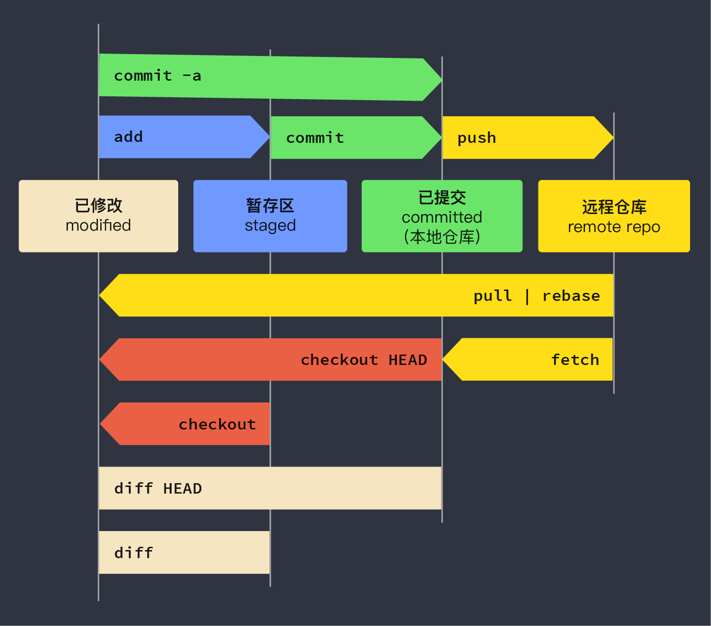

# Git

一图胜千言



一个不错的Cheat sheet:
[Git Cheat Sheet](http://ndpsoftware.com/git-cheatsheet.html)

### 

### 配置

- **git config --global user.name "<姓名>"** 设置提交者姓名。
- **git config --global user.email "<邮箱>"** 设置提交者邮箱。

### 基础操作

- **git init [目录名]** 在指定目录创建仓库，如果没有指定`目录名`将在当前目录创建仓库。
- **git clone <远程仓库地址> [目录名]** 从指定地址克隆仓库，若不指定`目录名`将默认创建与远程同名目录。
- **git add <目录名|文件名>** 将文件或目录中已修改的代码添加追暂存区。
- **git commit -m "<注释>"** 提交暂存区内容。
- **git status** 查看仓库状态

### 比对 `diff`

- **git diff** 比对当前内容和暂存区内容。
- **git diff HEAD** 比对当前内容和最近一次提交。
- **git diff HEAD^** 比对当前内容和倒数第二次提交。
- **git diff HEAD^ HEAD** 比对最近两次提交。

### 历史 `log`

- **git log --oneline** 查看提交历史。
- **git log --oneline** 打印为单行log。
- **git log --all** 打印所有记录（忽略HEAD的位置）。
- **git log --graph** 打印示意图（忽略HEAD的位置）。

### 分支 `branch`

- **git branch [分支]** 有`分支`：创建分支，无`分支`：列出所有分支。
- **git checkout <分支>** 切换至`分支`。
- **git checkout -b <分支>** 创建并切换至分支`分支`。
- **git merge <分支>** 将`分支`与当前分支合并。

### 远程

- `git pull` 拉取远程仓库。
- `git push <远程仓库> <分支>` 推送至远程仓库。
- `git remote add origin https://xxx.git` 新增远程仓库`origin`
- `git remote set-url origin https://xxx.git` 修改远程仓库`origin`


### 删除本地文件后，想从远程仓库中从新Pull最新版文件。

Git提示：up-to-date，但未得到删除的文件

原因：当前本地库处于另一个分支中，需将本分支发 Head 重置至 master

```git
git checkout master 
git reset --hard12
```

git 强行 pull 并覆盖本地文件

```git
git fetch --all  
git reset --hard origin/master 
git pull
```

