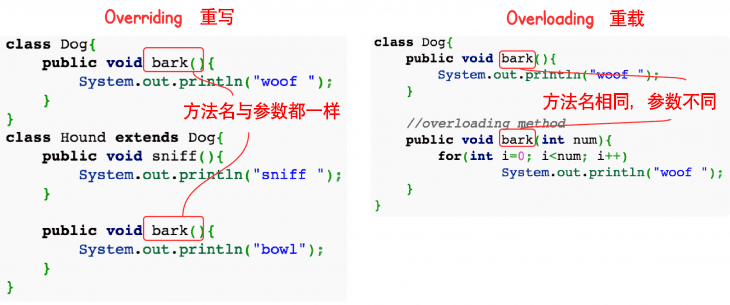
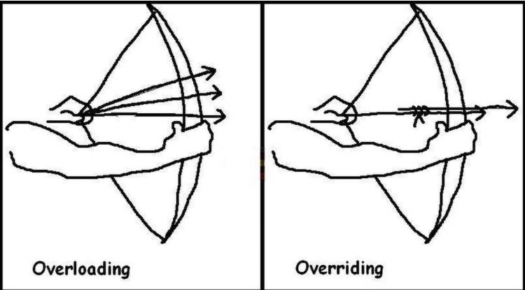

## 前言

为了更好的总结Java面试中的系统知识结构，当前仓库根据以下资料整理学习笔记。持续更新中...

- [Interview-Notebook/Java 基础.md at master · CyC2018/Interview-Notebook](https://github.com/CyC2018/Interview-Notebook/blob/master/notes/Java%20%E5%9F%BA%E7%A1%80.md#%E5%85%AD%E5%85%B3%E9%94%AE%E5%AD%97)
- 《Java程序员面试笔试宝典》
- 《阿里面经》

from 2018/7/11


[TOC]


## 目录

### 一、基本概念

#### （一）基础

#### 1. Java程序初始化的顺序是怎么样的（B50）


#### （二）反射、泛型、注解

#### 2. 什么是反射

​	通过Class获取class信息称之为反射（Reflection）。

#### 3. 什么是注解


#### 4. 什么是泛型


#### 3. 为什么要实现内存模型？

- 内存模型的就是为了在现代计算机平台中保证程序可以正确性的执行，但是不同的平台实现是不同的。 
- 编译器中生成的指令顺序， 可以与源代码中的顺序不同； 
- 编译器可能把变量保存在寄存器而不是内存中； 
- 处理器可以采用乱序或并行等方式来执行指令； 
- 缓存可能会改变将写入变量提交到主内存的次序； 
- 保存在处理器本地缓存中的值，对其他处理器是不可见的； 


### 二、面向对象

#### 1. Java的四个基本特性（<u>抽象、封装、继承，多态</u>），对多态的理解(多态的实现方式)以及在项目中那些地方用到多态

- Java的四个基本特性 
  - **抽象**：抽象是将一类对象的共同特征总结出来构造类的过程，包括<u>数据抽象</u>和<u>行为抽象</u>两方面。抽象只关注对象有哪些属性和行为，并不关注这些行为的细节是什么。  
  - **继承**：继承是从已有类得到继承信息创建新类的过程。提供继承信息的类被称为父类（超类、基类）；得到继承信息的类被称为子类（派生类）。继承让变化中的软件系统有了一定的延续性，同时继承也是封装程序中可变因素的重要手段。 
  - **封装**：通常认为封装是把数据和操作数据的方法绑定起来，对数据的访问只能通过已定义的接口。面向对象的本质就是将现实世界描绘成一系列完全自治、封闭的对象。我们在类中编写的方法就是对实现细节的一种封装；我们编写一个类就是对数据和数据操作的封装。可以说，封装就是隐藏一切可隐藏的东西，只向外界提供最简单的编程接口。 
  - **多态**：多态性是指允许不同子类型的对象对同一消息作出不同的响应。 
- 多态的理解(多态的实现方式) 
  - **方法重载（overload）**实现的是**<u>编译时的多态性</u>**（也称为前绑定）。 
  - **方法重写（override）**实现的是<u>**运行时的多态性**</u>（也称为后绑定）。运行时的多态是面向对象最精髓的东西。 
  - 要实现多态需要做两件事：
    - 1). **方法重写**（子类继承父类并重写父类中已有的或抽象的方法）；
    - 2). **对象造型**（用父类型引用引用子类型对象，这样同样的引用调用同样的方法就会根据子类对象的不同而表现出不同的行为）。 
- 项目中对多态的应用 
  - 举一个简单的例子，在物流信息管理系统中，有两种用户：订购客户和卖房客户，两个客户都可以登录系统，他们有相同的方法Login，但登陆之后他们会进入到不同的页面，也就是在登录的时候会有不同的操作，两种客户都继承父类的Login方法，但对于不同的对象，拥有不同的操作。 
- 面相对象开发方式优点（B65）
  - 较高的开发效率
  - 保证软件的鲁棒性
  - 保证软件的高可维护性


#### 2. 什么是重载和重写？

- **重载：**<u>重载发生在同一个类中</u>，同名的方法如果有不同的参数列表（*参数类型不同、参数个数不同或者二者都不同*）则视为重载。 
- **重写：**<u>重写发生在子类与父类之间</u>，重写要求子类被重写方法与父类被重写方法有相同的返回类型，比父类被重写方法更好访问，不能比父类被重写方法声明更多的异常（里氏代换原则）。根据不同的子类对象确定调用的那个方法。 






#### 3. 面向对象和面向过程的区别？用面向过程可以实现面向对象吗？那是不是不能面向对象？

- 面向对象和面向过程的区别 
  - **面向过程**就像是一个细心的管家，事无具细的都要考虑到。而**面向对象**就像是个家用电器，你只需要知道他的功能，不需要知道它的工作原理。 
  - **面向过程**是一种是“事件”为中心的编程思想。就是分析出解决问题所需的步骤，然后用函数把这些步骤实现，并按顺序调用。**面向对象**是以“对象”为中心的编程思想。 
  - 简单的举个例子：汽车发动、汽车到站 
    - 这对于**“面向过程”**来说，是两个事件，汽车启动是一个事件，汽车到站是另一个事件，面向过程编程的过程中我们关心的是事件，而不是汽车本身。针对上述两个事件，形成两个函数，之 后依次调用。 
    - 然而这对于**“面向对象”**来说，我们关心的是汽车这类对象，两个事件只是这类对象所具有的行为。而且对于这两个行为的顺序没有强制要求。 
- 用面向过程可以实现面向对象吗 ？
- 那是不是不能面向对象 ？


#### 4. 面向对象开发的六个基本原则(单一职责、开放封闭、里氏替换、依赖倒置、合成聚合复用、接口隔离)，迪米特法则。在项目中用过哪些原则

- **六个基本原则**（参考《设计模式之禅》）

  - **单一职责**（Single Responsibility Principle 简称 SRP）：**一个类应该仅有一个引起它变化的原因。**在面向对象中，如果只让一个类完成它该做的事，而不涉及与它无关的领域就是践行了高内聚的原则，这个类就只有单一职责。 

  - **里氏替换**（Liskov Substitution Principle 简称 LSP）：**任何时候子类型能够替换掉它们的父类型。**子类一定是增加父类的能力而不是减少父类的能力，因为子类比父类的能力更多，把能力多的对象当成能力少的对象来用当然没有任何问题。 

  - **依赖倒置**（Dependence Inversion Principle 简称 DIP）：**要依赖于抽象，不要依赖于具体类。**要做到依赖倒置，应该做到：①高层模块不应该依赖底层模块，二者都应该依赖于抽象；②抽象不应该依赖于具体实现，具体实现应该依赖于抽象。

  - **接口隔离**（Interface Segregation Principle 简称 ISP）：**不应该强迫客户依赖于他们不用的方法 。**接口要小而专，绝不能大而全。臃肿的接口是对接口的污染，既然接口表示能力，那么一个接口只应该描述一种能力，接口也应该是高度内聚的。 

  - **最少知识原则**（Least Knowledge Principle 简称 LKP）：**只和你的朋友谈话。**迪米特法则又叫最少知识原则，一个对象应当对其他对象有尽可能少的了解。 

  - **开放封闭**（Open Closed Principle 简称 OCP）：**软件实体应当对扩展开放，对修改关闭。**要做到开闭有两个要点：①抽象是关键，一个系统中如果没有抽象类或接口系统就没有扩展点；②封装可变性，将系统中的各种可变因素封装到一个继承结构中，如果多个可变因素混杂在一起，系统将变得复杂而换乱。 

    

- 其他原则

  - 合成聚和复用：优先使用聚合或合成关系复用代码
  - 面向接口编程
  - 优先使用组合，而非继承
  - 一个类需要的数据应该隐藏在类的内部
  - 类之间应该零耦合，或者只有传导耦合，换句话说，类之间要么没关系，要么只使用另一个类的接口提供的操作
  - 在水平方向上尽可能统一地分布系统功能


- 项目中用到的原则 
  - 单一职责、开放封闭、合成聚合复用(最简单的例子就是String类)、接口隔离


#### 5.内部类有哪些

可以将一个类的定义放在另一个类的定义内部，这就是内部类。

在Java中内部类主要分为成员内部类、局部内部类、匿名内部类、静态内部类 

##### （一）成员内部类

成员内部类也是最普通的内部类，它是外围类的一个成员，所以他是可以**无限制的访问外围类的所有成员属性和方法，尽管是private的**，但是外围类要访问内部类的成员属性和方法则需要通过内部类实例来访问。

```java
public class OuterClass {
    private String str;
   
    public void outerDisplay(){
        System.out.println("outerClass...");
    }
    
    public class InnerClass{
        public void innerDisplay(){
            str = "chenssy..."; //使用外围内的属性
            System.out.println(str);
            outerDisplay();  //使用外围内的方法
        }
    }
    
    // 推荐使用getxxx()来获取成员内部类，尤其是该内部类的构造函数无参数时
    public InnerClass getInnerClass(){
        return new InnerClass();
    }
    
    public static void main(String[] args) {
        OuterClass outer = new OuterClass();
        OuterClass.InnerClass inner = outer.getInnerClass();
        inner.innerDisplay();
    }
}
--------------------
chenssy...
outerClass...
```

在成员内部类中要注意两点：

- 成员内部类中不能存在任何static的变量和方法；

- 成员内部类是依附于外围类的，所以只有先创建了外围类才能够创建内部类。   


##### （二）局部内部类

有这样一种内部类，它是嵌套在方法和作用于内的，对于这个类的使用主要是应用与解决比较复杂的问题，想创建一个类来辅助我们的解决方案，到那时又不希望这个类是公共可用的，所以就产生了局部内部类，局部内部类和成员内部类一样被编译，只是它的作用域发生了改变，它只能在该方法和属性中被使用，出了该方法和属性就会失效。 

```java
//定义在方法里：
public class Parcel5 {
    public Destionation destionation(String str){
        class PDestionation implements Destionation{
            private String label;
            private PDestionation(String whereTo){
                label = whereTo;
            }
            public String readLabel(){
                return label;
            }
        }
        return new PDestionation(str);
    }
    
    public static void main(String[] args) {
        Parcel5 parcel5 = new Parcel5();
        Destionation d = parcel5.destionation("chenssy");
    }
}

//定义在作用域内:
public class Parcel6 {
    private void internalTracking(boolean b){
        if(b){
            class TrackingSlip{
                private String id;
                TrackingSlip(String s) {
                    id = s;
                }
                String getSlip(){
                    return id;
                }
            }
            TrackingSlip ts = new TrackingSlip("chenssy");
            String string = ts.getSlip();
        }
    }
    
    public void track(){
        internalTracking(true);
    }
    
    public static void main(String[] args) {
        Parcel6 parcel6 = new Parcel6();
        parcel6.track();
    }
}
```


##### （三）匿名内部类

在做Swing编程中，我们经常使用这种方式来绑定事件 

```java
button2.addActionListener(  
                new ActionListener(){  
                    public void actionPerformed(ActionEvent e) {  
                        System.out.println("你按了按钮二");  
                    }  
                });
```

 我们咋一看可能觉得非常奇怪，因为这个内部类是没有名字的，在看如下这个例子： 

```java
public class OuterClass {
    public InnerClass getInnerClass(final int num,String str2){
        return new InnerClass(){
            int number = num + 3;
            public int getNumber(){
                return number;
            }
        };        /* 注意：分号不能省 */
    }
    
    public static void main(String[] args) {
        OuterClass out = new OuterClass();
        InnerClass inner = out.getInnerClass(2, "chenssy");
        System.out.println(inner.getNumber());
    }
}

interface InnerClass {
    int getNumber();
}

----------------
Output:
```

**这里我们就需要看清几个地方**

- 匿名内部类是没有访问修饰符的。

- new 匿名内部类，这个类首先是要存在的。如果我们将那个InnerClass接口注释掉，就会出现编译出错。

- 注意getInnerClass()方法的形参，第一个形参是用final修饰的，而第二个却没有。同时我们也发现第二个形参在匿名内部类中没有使用过，所以当所在方法的形参需要被匿名内部类使用，那么这个形参就必须为final。
- 匿名内部类是没有构造方法的。因为它连名字都没有何来构造方法。


##### （四）静态内部类

关键字static中提到Static可以修饰成员变量、方法、代码块，其他它还可以修饰内部类，使用static修饰的内部类我们称之为静态内部类，不过我们更喜欢称之为嵌套内部类。静态内部类与非静态内部类之间存在一个最大的区别，我们知道非静态内部类在编译完成之后会隐含地保存着一个引用，该引用是指向创建它的外围内，但是静态内部类却没有。

1. 它的创建是不需要依赖于外围类的。

2. 它不能使用任何外围类的非static成员变量和方法。

```java
public class OuterClass {
    private String sex;
    public static String name = "chenssy";
    
    //静态内部类 
    static class InnerClass1{
        //在静态内部类中可以存在静态成员
        public static String _name1 = "chenssy_static";
        
        public void display(){ 
            //静态内部类只能访问外围类的静态成员变量和方法
		   //不能访问外围类的非静态成员变量和方法
            System.out.println("OutClass name :" + name);
        }
    }
    

    //非静态内部类
    class InnerClass2{
        // 非静态内部类中不能存在静态成员
        public String _name2 = "chenssy_inner";
        //非静态内部类中可以调用外围类的任何成员,不管是静态的还是非静态的
        public void display(){
            System.out.println("OuterClass name：" + name);
        }
    }
    
    //外围类方法
    public void display(){
        //外围类访问静态内部类：内部类
        System.out.println(InnerClass1._name1);
        //静态内部类 可以直接创建实例不需要依赖于外围类
        new InnerClass1().display();
        
        //非静态内部的创建需要依赖于外围类
        OuterClass.InnerClass2 inner2 = new OuterClass().new InnerClass2();
        //方位非静态内部类的成员需要使用非静态内部类的实例
        System.out.println(inner2._name2);
        inner2.display();
    }
    
    public static void main(String[] args) {
        OuterClass outer = new OuterClass();
        outer.display();
    }
}
----------------
Output:
chenssy_static
OutClass name :chenssy
chenssy_inner
OuterClass name：chenssy
```


#### 6. 组合、继承和代理的区别

**定义：**

- 组合：在新类中new 另外一个类的对象，以添加该对象的特性。
- 继承：从基类继承得到子类，获得基类的特性。
- 代理：在代理类中创建某功能的类，调用类的一些方法以获得该类的部分特性。

**使用场合：**

- 组合：各部件之间没什么关系，只需要组合即可。like组装电脑，需要new CPU(),new RAM(),new Disk()……
- 继承：子类需要具有父类的功能，各子类之间有所差异。like Shape类作为基类，子类有Rectangle，CirCle，Triangle……代码不写了，大家都经常用。
- 代理：飞机控制类，我不想暴露太多飞机控制的功能，只需部分前进左右转的控制（而不需要暴露发射导弹功能）。通过在代理类中new一个飞机控制对象，然后在方法中添加飞机控制类的各个需要暴露的功能。

**说明：**

继承：<u>代码复用，引用不灵活</u>； 组合：<u>代码复用</u>， 接口：<u>引用灵活</u>； 推荐组合+接口使用，看IO中包装流FilterInputStream中的策略模式

 

### 三、关键字

#### 1. final与static的区别

**final**

- **1. 数据**
  - 声明数据为常量，可以是编译时常量，也可以是在运行时被初始化后不能被改变的常量。
  - 对于基本类型，final 使数值不变；
  - 对于引用类型，final 使引用不变，也就不能引用其它对象，但是被引用的对象本身是可以修改的。

```java
final int x = 1;
// x = 2;  // cannot assign value to final variable 'x'
final A y = new A();
y.a = 1;
```

- **2. 方法**

  ​       声明方法不能被子类覆盖。

  - private 方法隐式地被指定为 final，如果在子类中定义的方法和基类中的一个 private 方法签名相同，此时子类的方法不是覆盖基类方法，而是在子类中定义了一个新的方法。

- **3. 类**

  - 声明类不允许被继承。


**static**

- **1. 静态变量**

  ​       静态变量在内存中只存在一份，只在类初始化时赋值一次。

  - 静态变量：类所有的实例都共享静态变量，可以直接通过类名来访问它；
  - 实例变量：每创建一个实例就会产生一个实例变量，它与该实例同生共死。

```java
public class A {
    private int x;        // 实例变量
    public static int y;  // 静态变量
}
```

​	注意：不能再城院函数内部定义static变量。

- **2. 静态方法**

  静态方法在类加载的时候就存在了，它不依赖于任何实例，所以静态方法必须有实现，也就是说它不能是抽象方法（abstract）。

- **3. 静态语句块**

  静态语句块在类初始化时运行一次。

- **4. 静态内部类**

  内部类的一种，静态内部类不依赖外部类，且不能访问外部类的非静态的变量和方法。

- **5. 静态导包** 

```java
import static com.xxx.ClassName.*
```

在使用静态变量和方法时不用再指明 ClassName，从而简化代码，但可读性大大降低。

- **6. 变量赋值顺序** 

  静态变量的赋值和静态语句块的运行优先于实例变量的赋值和普通语句块的运行，静态变量的赋值和静态语句块的运行哪个先执行取决于它们在代码中的顺序。

```java
public static String staticField = "静态变量";
```

```java
static {
    System.out.println("静态语句块");
}
```

```java
public String field = "实例变量";
```

```java
{
    System.out.println("普通语句块");
}
```

​	最后才运行构造函数

```java
public InitialOrderTest() {
    System.out.println("构造函数");
}
```

存在继承的情况下，初始化顺序为：

- 父类（静态变量、静态语句块）
- 子类（静态变量、静态语句块）
- 父类（实例变量、普通语句块）
- 父类（构造函数）
- 子类（实例变量、普通语句块）
- 子类（构造函数）


#### 1. break、continue、return


#### 2. final、finally和finalize有什么区别


#### 3. assert


#### 4. volatile

​	volatile是一个类型修饰符（type specifier），它是被设计用来修饰被不同线程访问和修改的变量。在使用volatile修饰成员变量后，所有线程在任何时间所看到变量的值都是相同的。此外，使用volatile会组织编译器对代码的优化，因此会降低程序的执行效率。所以，除非迫不得已，否则，能不使用volatile就尽量不要使用volatile

- 每次访问变量时，总是获取主内存的最新值
- 每次修改变量后，立刻协会到主内存中


#### 5. instanceof


#### 6. strictfp

strictfp, 即 **strict float point** (精确浮点)。 

strictfp 关键字可应用于类、接口或方法。使用 strictfp 关键字声明一个方法时，该方法中所有的float和double表达式都严格遵守FP-strict的限制,符合IEEE-754规范。当对一个类或接口使用 strictfp 关键字时，该类中的所有代码，包括嵌套类型中的初始设定值和代码，都将严格地进行计算。严格约束意味着所有表达式的结果都必须是 IEEE 754 算法对操作数预期的结果，以单精度和双精度格式表示。

如果你想让你的浮点运算更加精确，而且不会因为不同的硬件平台所执行的结果不一致的话，可以用关键字strictfp.


#### 7. transient

我们都知道一个对象只要实现了Serilizable接口，这个对象就可以被序列化，java的这种序列化模式为开发者提供了很多便利，我们可以不必关系具体序列化的过程，只要这个类实现了Serilizable接口，这个类的所有属性和方法都会自动序列化。

然而在实际开发过程中，我们常常会遇到这样的问题，这个类的有些属性需要序列化，而其他属性不需要被序列化，打个比方，如果一个用户有一些敏感信息（如密码，银行卡号等），为了安全起见，不希望在网络操作（主要涉及到序列化操作，本地序列化缓存也适用）中被传输，这些信息对应的变量就可以加上transient关键字。换句话说，这个字段的生命周期仅存于调用者的内存中而不会写到磁盘里持久化。

总之，java 的transient关键字为我们提供了便利，你只需要实现Serilizable接口，将不需要序列化的属性前添加关键字transient，序列化对象的时候，这个属性就不会序列化到指定的目的地中。

**参考资料**：[Java transient关键字使用小记 - Alexia(minmin) - 博客园](https://www.cnblogs.com/lanxuezaipiao/p/3369962.html)


### 四、基本数据类型与运算

#### 1. Java的基本数据类型/引用类型有哪些？知道自动装箱和拆箱吗？

- 4类8种基本数据类型。4整数型，2浮点型，1字符型，1布尔型

| 数据类型 | 存储需求 | 取值范围                                                     | 对应包装类 |
| -------- | -------- | ------------------------------------------------------------ | ---------- |
| byte     | 8位      | 最大存储数据量是255，存放的数据范围是-128~127之间            | Byte       |
| short    | 16位     | 最大数据存储量是65536，数据范围是-32768~32767之间            | Short      |
| int      | 32位     | 最大数据存储容量是2的32次方减1，数据范围是负的2的31次方到正的2的31次方减1 | Integer    |
| long     | 64位     | 最大数据存储容量是2的64次方减1，数据范围为负的2的63次方到正的2的63次方减1 | Long       |
| float    | 32位     | 数据范围在3.4e-45~1.4e38，直接赋值时必须在数字后加上f或F     | Float      |
| double   | 64位     | 数据范围在4.9e-324~1.8e308，赋值时可以加d或D也可以不加       | Double     |
| boolean  | 1位      | 只有true和false两个取值                                      | Boolean    |
| char     | 16位     | 存储Unicode码，用单引号赋值                                  | Character  |

- 引用数据类型
  - 类（class）、接口（interface）、数组
- 自动装箱和拆箱
  - 基本数据类型和它对应的封装类型之间可以相互转换。自动拆装箱是`jdk5.0`提供的新特特性，它可以自动实现类型的转换
  - **装箱**：从<u>基本数据类型</u>到<u>封装类型</u>叫做装箱
  - **拆箱**：从<u>封装类型</u>到<u>基本数据类型</u>叫拆箱

```
jdk 1.5
public class TestDemo {
    public static void main(String[] args) {
        Integer m =10;
        int i=m;
    }
}
```

​	上面的代码在jdk1.4以后的版本都不会报错，它实现了自动拆装箱的功能，如果是jdk1.4，就得这样写了

```
jdk 1.4
public class TestDemo {
    public static void main(String[] args) {
        Integer b = new Integer(210);
        int c = b.intValue();
    }
}
```


#### 2.缓存池

`new Integer(123) `与` Integer.valueOf(123) `的区别在于，new Integer(123) 每次都会新建一个对象，而 Integer.valueOf(123) 可能会使用缓存对象，因此多次使用 Integer.valueOf(123) 会取得同一个对象的引用。

```java
Integer x = new Integer(123);
Integer y = new Integer(123);
System.out.println(x == y);    // false
Integer z = Integer.valueOf(123);
Integer k = Integer.valueOf(123);
System.out.println(z == k);   // true
```

编译器会在自动装箱过程调用 valueOf() 方法，因此多个 Integer 实例使用自动装箱来创建并且值相同，那么就会引用相同的对象。

```java
Integer m = 123;
Integer n = 123;
System.out.println(m == n); // true
```

valueOf() 方法的实现比较简单，就是先判断值是否在缓存池中，如果在的话就直接使用缓存池的内容。

```java
public static Integer valueOf(int i) {
    if (i >= IntegerCache.low && i <= IntegerCache.high)
        return IntegerCache.cache[i + (-IntegerCache.low)];
    return new Integer(i);
}
```

在 Java 8 中，Integer 缓存池的大小默认为 -128\~127。

```java
static final int low = -128;
static final int high;
static final Integer cache[];

static {
    // high value may be configured by property
    int h = 127;
    String integerCacheHighPropValue =
        sun.misc.VM.getSavedProperty("java.lang.Integer.IntegerCache.high");
    if (integerCacheHighPropValue != null) {
        try {
            int i = parseInt(integerCacheHighPropValue);
            i = Math.max(i, 127);
            // Maximum array size is Integer.MAX_VALUE
            h = Math.min(i, Integer.MAX_VALUE - (-low) -1);
        } catch( NumberFormatException nfe) {
            // If the property cannot be parsed into an int, ignore it.
        }
    }
    high = h;

    cache = new Integer[(high - low) + 1];
    int j = low;
    for(int k = 0; k < cache.length; k++)
        cache[k] = new Integer(j++);

    // range [-128, 127] must be interned (JLS7 5.1.7)
    assert IntegerCache.high >= 127;
}
```

Java 还将一些其它基本类型的值放在缓冲池中，包含以下这些：

- boolean values true and false
- all byte values
- short values between -128 and 127
- int values between -128 and 127
- char in the range \u0000 to \u007F

因此在使用这些基本类型对应的包装类型时，就可以直接使用缓冲池中的对象。

[StackOverflow : Differences between new Integer(123), Integer.valueOf(123) and just 123
](https://stackoverflow.com/questions/9030817/differences-between-new-integer123-integer-valueof123-and-just-123)


### 五、字符串与数组

#### 1. String、StringBuffer、StringBuilder以及对String不变性的理解

- String、StringBuffer、StringBuilder 
  - 都是 final 类, 都不允许被继承; 
  - String 长度是不可变的, StringBuffer、StringBuilder 长度是可变的; 
  - StringBuffer 是线程安全的, StringBuilder 不是线程安全的，但它们两个中的所有方法都是相同的，StringBuffer在StringBuilder的方法之上添加了synchronized修饰，保证线程安全。 
  - StringBuilder比StringBuffer拥有更好的性能。 
  - 如果一个String类型的字符串，在编译时就可以确定是一个字符串常量，则编译完成之后，字符串会自动拼接成一个常量。此时String的速度比StringBuffer和StringBuilder的性能好的多。 
- String不变性的理解 
  - String 类是被final进行修饰的，不能被继承。 
  - 在用+号链接字符串的时候会创建新的字符串。 
  - String s = new String("Hello world"); 可能创建两个对象也可能创建一个对象。如果静态区中有“Hello world”字符串常量对象的话，则仅仅在堆中创建一个对象。如果静态区中没有“Hello world”对象，则堆上和静态区中都需要创建对象。 
  - 在 java 中, 通过使用 "+" 符号来串联字符串的时候, 实际上底层会转成通过 StringBuilder 实例的 append() 方法来实现。 

 

#### 2. String有重写Object的hashcode和toString吗？如果重写equals不重写hashcode会出现什么问题？

- String有重写Object的hashcode和toString吗？ 

  - String重写了Object类的hashcode和toString方法。 

- 当equals方法被重写时，通常有必要重写hashCode方法，以维护hashCode方法的常规协定，该协定声明相对等的两个对象必须有相同的hashCode 

  - object1.euqal(object2)时为true， object1.hashCode() ==  object2.hashCode() 为true 
  - object1.hashCode() ==  object2.hashCode() 为false时，object1.euqal(object2)必定为false 
  - object1.hashCode() ==  object2.hashCode() 为true时，但object1.euqal(object2)不一定定为true 

- 重写equals不重写hashcode会出现什么问题 

  - 在存储散列集合时(如Set类)，如果原对象.equals(新对象)，但没有对hashCode重写，即两个对象拥有不同的hashCode，则在集合中将会存储两个值相同的对象，从而导致混淆。因此在重写equals方法时，必须重写hashCode方法。 

  

#### 3. 如果你定义一个类，包括学号，姓名，分数，如何把这个对象作为key？要重写equals和hashcode吗

- 需要重写equals方法和hashcode，必须保证对象的属性改变时，其hashcode不能改变。 


### 六、异常处理

#### 1. 常见异常分为那两种(Exception，Error)，常见异常的基类以及常见的异常

- Throwable是java语言中所有错误和异常的超类（万物即可抛）。它有两个子类：Error、Exception。 

- 异常种类 

  - Error：Error为错误，是程序无法处理的，如OutOfMemoryError、ThreadDeath等，出现这种情况你唯一能做的就是听之任之，交由JVM来处理，不过JVM在大多数情况下会选择终止线程。 
  - Exception：Exception是程序可以处理的异常。它又分为两种CheckedException（受捡异常），一种是UncheckedException（不受检异常）。 
    - CheckException发生在编译阶段，必须要使用try…catch（或者throws）否则编译不通过。 
    - UncheckedException发生在运行期，具有不确定性，主要是由于程序的逻辑问题所引起的，难以排查，我们一般都需要纵观全局才能够发现这类的异常错误，所以在程序设计中我们需要认真考虑，好好写代码，尽量处理异常，即使产生了异常，也能尽量保证程序朝着有利方向发展。 

- 常见异常的基类 

  - IOException 
  - RuntimeException 

- 常见的异常 

  


### 七、Object 通用方法

#### 1.概述

```java
public final native Class<?> getClass()

public native int hashCode()

public boolean equals(Object obj)

protected native Object clone() throws CloneNotSupportedException

public String toString()

public final native void notify()

public final native void notifyAll()

public final native void wait(long timeout) throws InterruptedException

public final void wait(long timeout, int nanos) throws InterruptedException

public final void wait() throws InterruptedException

protected void finalize() throws Throwable {} // JVM内存回收之finalize()方法
```

#### equals()

**1. equals() 与 == 的区别** 

- 对于基本类型，== 判断两个值是否相等，基本类型没有 equals() 方法。
- 对于引用类型，== 判断两个实例是否引用同一个对象，而 equals() 判断引用的对象是否等价。

```java
Integer x = new Integer(1);
Integer y = new Integer(1);
System.out.println(x.equals(y)); // true
System.out.println(x == y);      // false
```

**2. 等价关系** 

（一）自反性

```java
x.equals(x); // true
```

（二）对称性

```java
x.equals(y) == y.equals(x); // true
```

（三）传递性

```java
if (x.equals(y) && y.equals(z))
    x.equals(z); // true;
```

（四）一致性

多次调用 equals() 方法结果不变

```java
x.equals(y) == x.equals(y); // true
```

（五）与 null 的比较

对任何不是 null 的对象 x 调用 x.equals(null) 结果都为 false

```java
x.euqals(null); // false;
```

**3. 实现** 

- 检查是否为同一个对象的引用，如果是直接返回 true；
- 检查是否是同一个类型，如果不是，直接返回 false；
- 将 Object 实例进行转型；
- 判断每个关键域是否相等。

```java
public class EqualExample {
    private int x;
    private int y;
    private int z;

    public EqualExample(int x, int y, int z) {
        this.x = x;
        this.y = y;
        this.z = z;
    }

    @Override
    public boolean equals(Object o) {
        if (this == o) return true;
        if (o == null || getClass() != o.getClass()) return false;

        EqualExample that = (EqualExample) o;

        if (x != that.x) return false;
        if (y != that.y) return false;
        return z == that.z;
    }
}
```

#### hashCode()

hasCode() 返回散列值，而 equals() 是用来判断两个实例是否等价。<u>等价的两个实例散列值一定要相同，但是散列值相同的两个实例不一定等价。</u>

在覆盖 equals() 方法时应当总是覆盖 hashCode() 方法，保证等价的两个实例散列值也相等。

下面的代码中，新建了两个等价的实例，并将它们添加到 HashSet 中。我们希望将这两个实例当成一样的，只在集合中添加一个实例，但是因为 EqualExample 没有实现 hasCode() 方法，因此这两个实例的散列值是不同的，最终导致集合添加了两个等价的实例。

```java
EqualExample e1 = new EqualExample(1, 1, 1);
EqualExample e2 = new EqualExample(1, 1, 1);
System.out.println(e1.equals(e2)); // true
HashSet<EqualExample> set = new HashSet<>();
set.add(e1);
set.add(e2);
System.out.println(set.size());   // 2
```

理想的散列函数应当具有均匀性，即不相等的实例应当均匀分布到所有可能的散列值上。这就要求了散列函数要把所有域的值都考虑进来，可以将每个域都当成 R 进制的某一位，然后组成一个 R 进制的整数。R 一般取 31，因为它是一个奇素数，如果是偶数的话，当出现乘法溢出，信息就会丢失，因为与 2 相乘相当于向左移一位。

一个数与 31 相乘可以转换成移位和减法：`31\*x == (x<<5)-x`，编译器会自动进行这个优化。

```java
@Override
public int hashCode() {
    int result = 17;
    result = 31 * result + x;
    result = 31 * result + y;
    result = 31 * result + z;
    return result;
}
```

#### toString()

默认返回 ToStringExample@4554617c 这种形式，其中 @ 后面的数值为散列码的无符号十六进制表示。

```java
public class ToStringExample {
    private int number;

    public ToStringExample(int number) {
        this.number = number;
    }
}
```

```java
ToStringExample example = new ToStringExample(123);
System.out.println(example.toString());
```

```html
ToStringExample@4554617c
```

#### clone()

**1. cloneable** 

clone() 是 Object 的 protect 方法，它不是 public，一个类不显式去重写 clone()，其它类就不能直接去调用该类实例的 clone() 方法。

```java
public class CloneExample {
    private int a;
    private int b;
}
```

```java
CloneExample e1 = new CloneExample();
// CloneExample e2 = e1.clone(); // 'clone()' has protected access in 'java.lang.Object'
```

重写 clone() 得到以下实现：

```java
public class CloneExample {
    private int a;
    private int b;

    @Override
    protected CloneExample clone() throws CloneNotSupportedException {
        return (CloneExample)super.clone();
    }
}
```

```java
CloneExample e1 = new CloneExample();
try {
    CloneExample e2 = e1.clone();
} catch (CloneNotSupportedException e) {
    e.printStackTrace();
}
```

```html
java.lang.CloneNotSupportedException: CloneTest
```

以上抛出了 CloneNotSupportedException，这是因为 CloneTest 没有实现 Cloneable 接口。

```java
public class CloneExample implements Cloneable {
    private int a;
    private int b;

    @Override
    protected Object clone() throws CloneNotSupportedException {
        return super.clone();
    }
}
```

应该注意的是，clone() 方法并不是 Cloneable 接口的方法，而是 Object 的一个 protected 方法。Cloneable 接口只是规定，如果一个类没有实现 Cloneable 接口又调用了 clone() 方法，就会抛出 CloneNotSupportedException。


#### 2. 深拷贝与浅拷贝 

- 浅拷贝：对基本数据类型进行值传递，对引用数据类型进行引用传递般的拷贝，此为浅拷贝。 


- 深拷贝：对基本数据类型进行值传递，对引用数据类型，创建一个新的对象，并复制其内容，此为深拷贝。 


