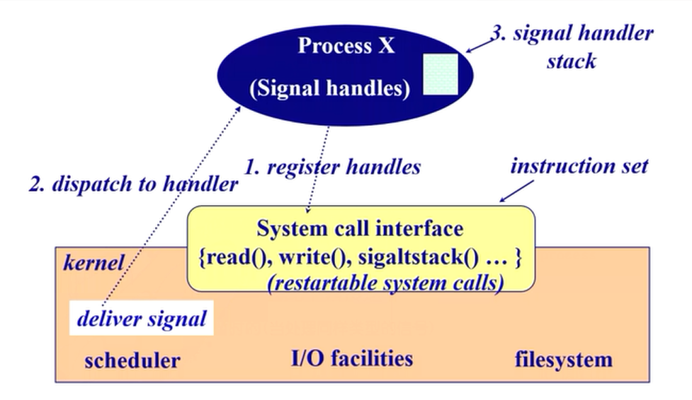

[TOC]


# 前言

在本文将深入展开在面试过程中操作系统部分的知识，用最简短的篇章深入理解。


# 一、概述


## 1. 操作系统基本特征

### 1. 并发

并发是指宏观上在一段时间内能同时运行多个程序，而并行则指同一时刻能运行多个指令。

并行需要硬件支持，如多流水线或者多处理器。

操作系统通过引入进程和线程，使得程序能够并发运行。

### 2. 共享

共享是指系统中的资源可以被多个并发进程共同使用。

有两种共享方式：互斥共享和同时共享。

互斥共享的资源称为临界资源，例如打印机等，在同一时间只允许一个进程访问，需要用同步机制来实现对临界资源的访问。

### 3. 虚拟

虚拟技术把一个物理实体转换为多个逻辑实体。

主要有两种虚拟技术：时分复用技术和空分复用技术。例如多个进程能在同一个处理器上并发执行使用了时分复用技术，让每个进程轮流占有处理器，每次只执行一小个时间片并快速切换。

### 4. 异步

异步指进程不是一次性执行完毕，而是走走停停，以不可知的速度向前推进。


## 2. 操作系统基本功能

### 1. 进程管理

进程控制、进程同步、进程通信、死锁处理、处理机调度等。

### 2. 内存管理

内存分配、地址映射、内存保护与共享、虚拟内存等。

### 3. 文件管理

文件存储空间的管理、目录管理、文件读写管理和保护等。

### 4. 设备管理

完成用户的 I/O 请求，方便用户使用各种设备，并提高设备的利用率。

主要包括缓冲管理、设备分配、设备处理、虛拟设备等。


## 3. 系统调用

如果一个进程在用户态需要使用内核态的功能，就进行系统调用从而陷入内核，由操作系统代为完成。

[](https://github.com/CyC2018/Interview-Notebook/blob/master/pics/tGPV0.png)

Linux 的系统调用主要有以下这些：

| Task     | Commands                    |
| -------- | --------------------------- |
| 进程控制 | fork(); exit(); wait();     |
| 进程通信 | pipe(); shmget(); mmap();   |
| 文件操作 | open(); read(); write();    |
| 设备操作 | ioctl(); read(); write();   |
| 信息维护 | getpid(); alarm(); sleep(); |
| 安全     | chmod(); umask(); chown();  |


## 4. 大内核和微内核

### 1. 大内核

大内核是将操作系统功能作为一个紧密结合的整体放到内核。

由于各模块共享信息，因此有很高的性能。

### 2. 微内核

由于操作系统不断复杂，因此将一部分操作系统功能移出内核，从而降低内核的复杂性。移出的部分根据分层的原则划分成若干服务，相互独立。

在微内核结构下，操作系统被划分成小的、定义良好的模块，只有微内核这一个模块运行在内核态，其余模块运行在用户态。

因为需要频繁地在用户态和核心态之间进行切换，所以会有一定的性能损失。

[](https://github.com/CyC2018/Interview-Notebook/blob/master/pics/2_14_microkernelArchitecture.jpg)


## 5. 中断分类

### 1. 外中断

由 CPU 执行指令以外的事件引起，如 I/O 完成中断，表示设备输入/输出处理已经完成，处理器能够发送下一个输入/输出请求。此外还有时钟中断、控制台中断等。

### 2. 异常

由 CPU 执行指令的内部事件引起，如非法操作码、地址越界、算术溢出等。

### 3. 陷入

在用户程序中使用系统调用。


## 6. 什么是堆和栈？说一下堆栈都存储哪些数据？

​	栈区（stack）— 由**编译器**自动分配释放 ，存放函数的参数值，局部变量的值等。其操作方式类似于数据结构中的栈。

​	堆区（heap） — 一般由**程序员分配释放**， 若程序员不释放，程序结束时可能由OS回收 。


## 7. 线程间通信和进程间通信？（简述）

### 线程间通信

- synchronized同步

  - 这种方式，本质上就是“共享内存”式的通信。多个线程需要访问同一个共享变量，谁拿到了锁（获得了访问权限），谁就可以执行。

- while轮询的方式

  - 在这种方式下，线程A不断地改变条件，线程ThreadB不停地通过while语句检测这个条件(list.size()==5)是否成立 ，从而实现了线程间的通信。但是这种方式会浪费CPU资源。之所以说它浪费资源，是因为JVM调度器将CPU交给线程B执行时，它没做啥“有用”的工作，只是在不断地测试 某个条件是否成立。就类似于现实生活中，某个人一直看着手机屏幕是否有电话来了，而不是： 在干别的事情，当有电话来时，响铃通知TA电话来了。

- wait/notify机制

  - 当条件未满足时，线程A调用wait() 放弃CPU，并进入阻塞状态。（不像while轮询那样占用CPU）

    当条件满足时，线程B调用 notify()通知 线程A，所谓通知线程A，就是唤醒线程A，并让它进入可运行状态。

- 管道通信

  - java.io.PipedInputStream 和 java.io.PipedOutputStream进行通信


### 进程间通信

- **管道（Pipe）** ：管道可用于具有亲缘关系进程间的通信，允许一个进程和另一个与它有共同祖先的进程之间进行通信。
- **命名管道（named pipe）** ：命名管道克服了管道没有名字的限制，因此，除具有管道所具有的功能外，它还允许无亲缘关 系 进程间的通信。命名管道在文件系统中有对应的文件名。命名管道通过命令mkfifo或系统调用mkfifo来创建。
- **信号（Signal）** ：信号是比较复杂的通信方式，用于通知接受进程有某种事件发生，除了用于进程间通信外，进程还可以发送 信号给进程本身；Linux除了支持Unix早期信号语义函数sigal外，还支持语义符合Posix.1标准的信号函数sigaction（实际上，该函数是基于BSD的，BSD为了实现可靠信号机制，又能够统一对外接口，用sigaction函数重新实现了signal函数）。
- **消息（Message）队列** ：消息队列是消息的链接表，包括Posix消息队列system V消息队列。有足够权限的进程可以向队列中添加消息，被赋予读权限的进程则可以读走队列中的消息。消息队列克服了信号承载信息量少，管道只能承载无格式字节流以及缓冲区大小受限等缺
- **共享内存** ：使得多个进程可以访问同一块内存空间，是最快的可用IPC形式。是针对其他通信机制运行效率较低而设计的。往往与其它通信机制，如信号量结合使用，来达到进程间的同步及互斥。
- **内存映射（mapped memory）** ：内存映射允许任何多个进程间通信，每一个使用该机制的进程通过把一个共享的文件映射到自己的进程地址空间来实现它。
- **信号量（semaphore）** ：主要作为进程间以及同一进程不同线程之间的同步手段。
- **套接口（Socket）** ：更为一般的进程间通信机制，可用于不同机器之间的进程间通信。起初是由Unix系统的BSD分支开发出来的，但现在一般可以移植到其它类Unix系统上：linux和System V的变种都支持套接字。


参考资料：

- [Java线程与线程、进程与进程之间通信方式 | 理想村 | 屠杭镝的博客](https://www.tuhd.top/2017/08/04/2017-08-04-threadandprocess/)
- [JAVA多线程之线程间的通信方式 - hapjin - 博客园](https://www.cnblogs.com/hapjin/p/5492619.html)


## 8. 如何理解分布式锁？

- 分布式锁，是控制分布式系统之间同步访问共享资源的一种方式。在分布式系统中，常常需要协调他们的动作。如果不同的系统或是同一个系统的不同主机之间共享了一个或一组资源，那么访问这些资源的时候，往往需要互斥来防止彼此干扰来保证一致性，在这种情况下，便需要使用到分布式锁。 


#二、进程管理

## 1. 进程与线程


### 1. 进程

**进程是资源分配的基本单位，用来管理资源（例如：内存，文件，网络等资源）**

进程控制块 (Process Control Block, PCB) 描述进程的基本信息和运行状态，所谓的创建进程和撤销进程，都是指对 PCB 的操作。**（PCB是描述进程的数据结构）**


### 2. 线程

线程是独立调度的基本单位，进程当中的一条执行流程。（寄存器、栈）

一个进程中可以有多个线程，它们共享进程资源。

线程又分为：用户线程、内核线程、轻量级线程


 

### 3. 区别

- 拥有资源：进程是资源分配的基本单位，但是线程不拥有资源，线程可以访问隶属进程的资源。
- 调度：线程是独立调度的基本单位，在同一进程中，线程的切换不会引起进程切换，从一个进程内的线程切换到另一个进程中的线程时，会引起进程切换。
- 系统开销：由于创建或撤销进程时，系统都要为之分配或回收资源，如内存空间、I/O 设备等，所付出的开销远大于创建或撤销线程时的开销。类似地，在进行进程切换时，涉及当前执行进程 CPU 环境的保存及新调度进程 CPU 环境的设置，而线程切换时只需保存和设置少量寄存器内容，开销很小。
- 通信方面：进程间通信 (IPC) 需要进程同步和互斥手段的辅助，以保证数据的一致性。而线程间可以通过直接读/写同一进程中的数据段（如全局变量）来进行通信。

举例：QQ 和浏览器是两个进程，浏览器进程里面有很多线程，例如 HTTP 请求线程、事件响应线程、渲染线程等等，线程的并发执行使得在浏览器中点击一个新链接从而发起 HTTP 请求时，浏览器还可以响应用户的其它事件。


## 2. 进程状态的切换（生命周期）


- **就绪状态（ready）**：等待被调度
- **运行状态（running）**
- **阻塞状态（waiting）**：等待资源


应该注意以下内容：

- 只有就绪态和运行态可以相互转换，其它的都是单向转换。就绪状态的进程通过调度算法从而获得 CPU 时间，转为运行状态；而运行状态的进程，在分配给它的 CPU 时间片用完之后就会转为就绪状态，等待下一次调度。
- 阻塞状态是缺少需要的资源从而由运行状态转换而来，但是该资源不包括 CPU 时间，缺少 CPU 时间会从运行态转换为就绪态。
- 进程只能自己阻塞自己，因为只有进程自身才知道何时需要等待某种事件的发生


## 3. 进程调度算法

不同环境的调度算法目标不同，因此需要针对不同环境来讨论调度算法。

### 1. 批处理系统

批处理系统没有太多的用户操作，在该系统中，调度算法目标是保证吞吐量和周转时间（从提交到终止的时间）。

**1.1 先来先服务 first-come first-serverd（FCFS）**

按照请求的顺序进行调度。

有利于长作业，但不利于短作业，因为短作业必须一直等待前面的长作业执行完毕才能执行，而长作业又需要执行很长时间，造成了短作业等待时间过长。

**1.2 短作业优先 shortest job first（SJF）**

按估计运行时间最短的顺序进行调度。

长作业有可能会饿死，处于一直等待短作业执行完毕的状态。因为如果一直有短作业到来，那么长作业永远得不到调度。

**1.3 最短剩余时间优先 shortest remaining time next（SRTN）**

按估计剩余时间最短的顺序进行调度。


### 2. 交互式系统

交互式系统有大量的用户交互操作，在该系统中调度算法的目标是快速地进行响应。

**2.1 时间片轮转**

将所有就绪进程按 FCFS 的原则排成一个队列，每次调度时，把 CPU 时间分配给队首进程，该进程可以执行一个时间片。当时间片用完时，由计时器发出时钟中断，调度程序便停止该进程的执行，并将它送往就绪队列的末尾，同时继续把 CPU 时间分配给队首的进程。

时间片轮转算法的效率和时间片的大小有很大关系。因为进程切换都要保存进程的信息并且载入新进程的信息，如果时间片太小，会导致进程切换得太频繁，在进程切换上就会花过多时间。

[](https://github.com/CyC2018/Interview-Notebook/blob/master/pics/8c662999-c16c-481c-9f40-1fdba5bc9167.png)

 

**2.2 优先级调度**

为每个进程分配一个优先级，按优先级进行调度。

为了防止低优先级的进程永远等不到调度，可以随着时间的推移增加等待进程的优先级。


**2.3 多级反馈队列**

如果一个进程需要执行 100 个时间片，如果采用时间片轮转调度算法，那么需要交换 100 次。

多级队列是为这种需要连续执行多个时间片的进程考虑，它设置了多个队列，每个队列时间片大小都不同，例如 1,2,4,8,..。进程在第一个队列没执行完，就会被移到下一个队列。这种方式下，之前的进程只需要交换 7 次。

每个队列优先权也不同，最上面的优先权最高。因此只有上一个队列没有进程在排队，才能调度当前队列上的进程。

可以将这种调度算法看成是**时间片轮转调度算法和优先级调度算法**的结合。

[](https://github.com/CyC2018/Interview-Notebook/blob/master/pics/042cf928-3c8e-4815-ae9c-f2780202c68f.png)

 

### 3. 实时系统

实时系统要求一个请求在一个确定时间内得到响应。

分为**硬实时和软实时**，前者必须满足绝对的截止时间，后者可以容忍一定的超时。


## 4. 进程同步

### 1. 临界区

**对临界资源进行访问的那段代码称为临界区**。

为了互斥访问临界资源，每个进程在进入临界区之前，需要先进行检查。

```
// entry section
// critical section;
// exit section
```

### 2. 同步与互斥

- 同步：多个进程按一定顺序执行；
- 互斥：多个进程在同一时刻只有一个进程能进入临界区。


### 3. 信号量

> P和V是来源于两个荷兰语词汇，P() ---prolaag （荷兰语，尝试减少的意思），V() ---verhoog（荷兰语，增加的意思）  

信号量（Semaphore）是一个整型变量，可以对其执行 down 和 up 操作，也就是常见的 P 和 V 操作。

- **down** : 如果信号量大于 0 ，执行 -1 操作；如果信号量等于 0，进程睡眠，等待信号量大于 0；（阻塞）
- **up** ：对信号量执行 +1 操作，唤醒睡眠的进程让其完成 down 操作。（唤醒）

down 和 up 操作需要被设计成原语，不可分割，通常的做法是在执行这些操作的时候屏蔽中断。

如果信号量的取值只能为 0 或者 1，那么就成为了 **互斥量（Mutex）** ，0 表示临界区已经加锁，1 表示临界区解锁。

```
typedef int semaphore;
semaphore mutex = 1;
void P1() {
    down(&mutex);
    // 临界区
    up(&mutex);
}

void P2() {
    down(&mutex);
    // 临界区
    up(&mutex);
}
```

**使用信号量实现生产者-消费者问题** 

问题描述：使用一个缓冲区来保存物品，只有缓冲区没有满，生产者才可以放入物品；只有缓冲区不为空，消费者才可以拿走物品。

因为缓冲区属于临界资源，因此需要使用一个互斥量 mutex 来控制对缓冲区的互斥访问。

为了同步生产者和消费者的行为，需要记录缓冲区中物品的数量。数量可以使用信号量来进行统计，这里需要使用两个信号量：empty 记录空缓冲区的数量，full 记录满缓冲区的数量。其中，empty 信号量是在生产者进程中使用，当 empty 不为 0 时，生产者才可以放入物品；full 信号量是在消费者进程中使用，当 full 信号量不为 0 时，消费者才可以取走物品。

注意，不能先对缓冲区进行加锁，再测试信号量。也就是说，不能先执行 down(mutex) 再执行 down(empty)。如果这么做了，那么可能会出现这种情况：生产者对缓冲区加锁后，执行 down(empty) 操作，发现 empty = 0，此时生产者睡眠。消费者不能进入临界区，因为生产者对缓冲区加锁了，也就无法执行 up(empty) 操作，empty 永远都为 0，那么生产者和消费者就会一直等待下去，造成死锁。

```
#define N 100
typedef int semaphore;
semaphore mutex = 1;
semaphore empty = N;
semaphore full = 0;

void producer() {
    while(TRUE){
        int item = produce_item();
        down(&empty);
        down(&mutex);
        insert_item(item);
        up(&mutex);
        up(&full);
    }
}

void consumer() {
    while(TRUE){
        down(&full);
        down(&mutex);
        int item = remove_item();
        up(&mutex);
        up(&empty);
        consume_item(item);
    }
}
```

### 4. 管程

使用信号量机制实现的生产者消费者问题需要客户端代码做很多控制，而管程把控制的代码独立出来，不仅不容易出错，也使得客户端代码调用更容易。

管程是为了解决信号量在临界区的PV操作上的配对的麻烦，把配对的PV操作集中在一起，生成的一种并发编程方法。其中使用了条件变量这种同步机制。 

c 语言不支持管程，下面的示例代码使用了类 Pascal 语言来描述管程。示例代码的管程提供了 insert() 和 remove() 方法，客户端代码通过调用这两个方法来解决生产者-消费者问题。

```
monitor ProducerConsumer
    integer i;
    condition c;

    procedure insert();
    begin
        // ...
    end;

    procedure remove();
    begin
        // ...
    end;
end monitor;
```

管程有一个重要特性：在一个时刻只能有一个进程使用管程。进程在无法继续执行的时候不能一直占用管程，否者其它进程永远不能使用管程。

管程引入了 **条件变量** 以及相关的操作：**wait()** 和 **signal()** 来实现同步操作。对条件变量执行 wait() 操作会导致调用进程阻塞，把管程让出来给另一个进程持有。signal() 操作用于唤醒被阻塞的进程。

**使用管程实现生产者-消费者问题** 

```
// 管程
monitor ProducerConsumer
    condition full, empty;
    integer count := 0;
    condition c;

    procedure insert(item: integer);
    begin
        if count = N then wait(full);
        insert_item(item);
        count := count + 1;
        if count = 1 then signal(empty);
    end;

    function remove: integer;
    begin
        if count = 0 then wait(empty);
        remove = remove_item;
        count := count - 1;
        if count = N -1 then signal(full);
    end;
end monitor;

// 生产者客户端
procedure producer
begin
    while true do
    begin
        item = produce_item;
        ProducerConsumer.insert(item);
    end
end;

// 消费者客户端
procedure consumer
begin
    while true do
    begin
        item = ProducerConsumer.remove;
        consume_item(item);
    end
end;
```


## 5. 经典同步问题

生产者和消费者问题前面已经讨论过了。

### 1. 读者-写者问题

允许多个进程同时对数据进行读操作，但是不允许读和写以及写和写操作同时发生。读者优先策略


Rcount：读操作的进程数量（Rcount=0）

CountMutex：对于Rcount进行加锁（CountMutex=1）

WriteMutex：互斥量对于写操作的加锁（WriteMutex=1）

```java
Rcount = 0;
semaphore CountMutex = 1;
semaphore WriteMutex = 1;

void writer(){
    while(true){
        sem_wait(WriteMutex);
        // TO DO write();
        sem_post(WriteMutex);
    }
}

// 读者优先策略
void reader(){
    while(true){
        sem_wait(CountMutex);
        if(Rcount == 0)
            sem_wait(WriteMutex);
        Rcount++;
        sem_post(CountMutex);
        
        // TO DO read();
        
        sem_wait(CountMutex);
        Rcount--;
        if(Rcount == 0)
            sem_post(WriteMutex);
        sem_post(CountMutex);
	}
}

```


### 2. 哲学家进餐问题

[](https://github.com/CyC2018/Interview-Notebook/blob/master/pics/a9077f06-7584-4f2b-8c20-3a8e46928820.jpg)

 


五个哲学家围着一张圆桌，每个哲学家面前放着食物。哲学家的生活有两种交替活动：吃饭以及思考。当一个哲学家吃饭时，需要先拿起自己左右两边的两根筷子，并且一次只能拿起一根筷子。

**方案一：**下面是一种错误的解法，考虑到如果所有哲学家同时拿起左手边的筷子，那么就无法拿起右手边的筷子，造成死锁。

```java
#define N 5		   // 哲学家个数
void philosopher(int i)  // 哲学家编号：0 － 4
{
    while(TRUE)
    {
        think();			// 哲学家在思考
        take_fork(i);			// 去拿左边的叉子
        take_fork((i + 1) % N);	// 去拿右边的叉子
        eat();				// 吃面条中….
        put_fork(i);			// 放下左边的叉子
        put_fork((i + 1) % N);	// 放下右边的叉子
    }
}

```


**方案二：对拿叉子的过程进行了改进，但仍不正确**

```java
#define N 5	 // 哲学家个数
while(1)  // 去拿两把叉子
{       
    take_fork(i);			// 去拿左边的叉子
    if(fork((i+1)%N)) {		// 右边叉子还在吗
    	take_fork((i + 1) % N);// 去拿右边的叉子
    	break;			// 两把叉子均到手
    }
    else {				// 右边叉子已不在
    	put_fork(i);		// 放下左边的叉子
    	wait_some_time();	// 等待一会儿
    }
}

```


**方案三：等待时间随机变化。可行，但非万全之策**

```java
#define N 5	 // 哲学家个数
while(1)  // 去拿两把叉子
{       
	take_fork(i);			// 去拿左边的叉子
	if(fork((i+1)%N)) {		// 右边叉子还在吗
	    take_fork((i + 1) % N);// 去拿右边的叉子
	    break;			// 两把叉子均到手
	}
	else {				// 右边叉子已不在
	    put_fork(i);		// 放下左边的叉子
	    wait_random_time( );	// 等待随机长时间
	}
}

```


**方案四：互斥访问。正确，但每次只允许一人进餐**

```java
semaphore mutex	   // 互斥信号量，初值1
void philosopher(int i)  // 哲学家编号i：0－4	
{
	while(TRUE){
	    think();			// 哲学家在思考
	    P(mutex);			// 进入临界区
	    take_fork(i);			// 去拿左边的叉子
	    take_fork((i + 1) % N);	// 去拿右边的叉子
	    eat();				// 吃面条中….
	    put_fork(i);			// 放下左边的叉子
	    put_fork((i + 1) % N);	// 放下右边的叉子
	    V(mutex);			// 退出临界区
	}
}

```


**正确方案如下：**

为了防止死锁的发生，可以设置两个条件（临界资源）：

- 必须同时拿起左右两根筷子；
- 只有在两个邻居都没有进餐的情况下才允许进餐。

```java
//1. 必须由一个数据结构，来描述每个哲学家当前的状态
#define N 5
#define LEFT i // 左邻居
#define RIGHT (i + 1) % N    // 右邻居
#define THINKING 0
#define HUNGRY   1
#define EATING   2
typedef int semaphore;
int state[N];                // 跟踪每个哲学家的状态

//2. 该状态是一个临界资源，对它的访问应该互斥地进行
semaphore mutex = 1;         // 临界区的互斥

//3. 一个哲学家吃饱后，可能要唤醒邻居，存在着同步关系
semaphore s[N];              // 每个哲学家一个信号量

void philosopher(int i) {
    while(TRUE) {
        think();
        take_two(i);
        eat();
        put_tow(i);
    }
}

void take_two(int i) {
    P(&mutex);  // 进入临界区
    state[i] = HUNGRY; // 我饿了
    test(i); // 试图拿两把叉子
    V(&mutex); // 退出临界区
    P(&s[i]); // 没有叉子便阻塞
}

void put_tow(i) {
    P(&mutex);
    state[i] = THINKING;
    test(LEFT);
    test(RIGHT);
    V(&mutex);
}

void test(i) {         // 尝试拿起两把筷子
    if(state[i] == HUNGRY && state[LEFT] != EATING && state[RIGHT] !=EATING) {
        state[i] = EATING;
        V(&s[i]); // 通知第i个人可以吃饭了
    }
}
```


## 6. 进程通信

IPC(Inter-Process Communication)进程间通信，提供了各种进程间通信的方法。在Linux C编程中有几种方法

1. 半双工Unix管道
2. FIFOs(命名管道)

3. 消息队列
4. 信号量
5. 共享内存
6. 网络Socket


进程同步与进程通信很容易混淆，它们的区别在于：

- 进程同步：控制多个进程按一定顺序执行；
- 进程通信：进程间传输信息。

进程通信是一种手段，而进程同步是一种目的。也可以说，为了能够达到进程同步的目的，需要让进程进行通信，传输一些进程同步所需要的信息。


### 进程通信方式


**直接通信：** 
进程必须正确命名对方，比如send（p，message）向p发送信息，receive（q，message）从q中接收信息 
通信链路有如下属性：自动建立连接；一条链路恰好对应一对通信进程；每对进程之间只有一个链接存在；链路可以是单向的，但是通常为双向的

**间接通信：** 

通过OS维护的消息队列实现进程之间的通信（接收发送信息） 
每个消息队列都有一个唯一标识，只有共享了相同消息队列的进程才能够通信 
通信链路有如下属性：只有共享了相同消息队列的进程才能建立连接，比如send（a，message）向消息队列a发送信息，receive（a，message）从消息队列a中接收信息 ；连接单向或者双向；消息队列可以与多个进程相互关联；每个进程共享多个消息队列（也就是进程和消息队列是多对多的关系）


### 1. 管道

<div align="center"> </div><br/>


- 子进程从父进程继承文件描述符
  - file descriptor 0 stdin, 1 stdout, 2stderr
- 进程不知道（或不关心！）从键盘，文件，程序读取或写入到终端，文件，程序。
- shell（ # ls | more）
  - 创建管道
  - 为ls创建一个进程，设置stdout为管道写端
  - 为more创建一个进程，设置stdin为管道读端


管道是通过调用 pipe 函数创建的，fd[0] 用于读，fd[1] 用于写。

```
#include <unistd.h>
int pipe(int fd[2]);
```

它具有以下限制：

- 只支持半双工通信（单向传输）；
- 只能在父子进程中使用。


[](https://github.com/CyC2018/Interview-Notebook/blob/master/pics/53cd9ade-b0a6-4399-b4de-7f1fbd06cdfb.png)

 

### 2. FIFO

管道没有名字，因此它们的最大劣势是只能用于有一个共同祖先进程的各个进程之间。我们无法在无亲缘关系的进程间创建一个管道并将它用作IPC管道（不考虑描述符传递）。

FIFO指先进先出（first in，first out），它是一个单向（半双工）数据流。不同于管道的是，每个FIFO有一个路径名与之关联，从而允许无亲缘关系的进程访问同一个FIFO。FIFO也称为有名管道（named pipe）。

```
#include <sys/stat.h>
int mkfifo(const char *path, mode_t mode);
int mkfifoat(int fd, const char *path, mode_t mode);
```

FIFO 常用于客户-服务器应用程序中，FIFO 用作汇聚点，在客户进程和服务器进程之间传递数据。

[](https://github.com/CyC2018/Interview-Notebook/blob/master/pics/2ac50b81-d92a-4401-b9ec-f2113ecc3076.png)

 

### 3. 消息队列

间接（内核）

相比于 FIFO，消息队列具有以下优点：

- 消息队列可以独立于读写进程存在，从而避免了 FIFO 中同步管道的打开和关闭时可能产生的困难；
- 避免了 FIFO 的同步阻塞问题，不需要进程自己提供同步方法；
- 读进程可以根据消息类型有选择地接收消息，而不像 FIFO 那样只能默认地接收。


### 4. 信号Signal

进程间的软件中断通知和处理机制，不能传递信息，起到通知作用

它是一个计数器，用于为多个进程提供对共享数据对象的访问。

软中断信号（signal，又简称为信号）用来通知进程发生了异步事件。在软件层次上是对中断机制的一种模拟，在原理上，一个进程收到一个信号与处理器收到一个中断请求可以说是一样的。信号是进程间通信机制中唯一的异步通信机制，一个进程不必通过任何操作来等待信号的到达，事实上，进程也不知道信号到底什么时候到达。进程之间可以互相通过系统调用kill发送软中断信号。内核也可以因为内部事件而给进程发送信号，通知进程发生了某个事件。信号机制除了基本通知功能外，还可以传递附加信息。

Examples：SIGFPE，SIGKILL，SIGUSR1，SIGSTOP，SIGCONT


处理方法可以分为三类：

1. 类似中断的处理程序，对于需要处理的信号，进程可以指定处理函数，由该函数来处理。
2. 忽略某个信号，对该信号不做任何处理，就象未发生过一样。
3. 对该信号的处理保留系统的默认值，这种缺省操作，对大部分的信号的缺省操作是使得进程终止。进程通过系统调用signal来指定进程对某个信号的处理行为。





### 5. 共享内存

直接通信

允许多个进程共享一个给定的存储区。因为数据不需要在进程之间复制，所以这是最快的一种 IPC。

需要使用信号量用来同步对共享存储的访问。

多个进程可以将同一个文件映射到它们的地址空间从而实现共享内存。另外 XSI 共享内存不是使用文件，而是使用使用内存的匿名段。


### 6. 套接字

与其它通信机制不同的是，它可用于不同机器间的进程通信。


## ★ 进程间通信有哪几种方式

- 管道(PIPE)：管道可用于具有亲缘关系进程间的通信，允许一个进程和另一个与它有共同祖先的进程之间进行通信。  
- 命名管道(FIFO)：命名管道克服了管道没有名字的限制，因此，除具有管道所具有的功能外，它还允许无亲缘关系进程间的通信。命名管道在文件系统中有对应的文件名。命名管道通过命令mkfifo或系统调用mkfifo来创建。  
- 信号(Signal)：信号是比较复杂的通信方式，用于通知接受进程有某种事件发生，除了用于进程间通信外，进程还可以发送信号给进程本身。 
- 消息队列(MessageQueue)：消息队列是消息的链接表，包括Posix消息队列system V消息队列。有足够权限的进程可以向队列中添加消息，被赋予读权限的进程则可以读走队列中的消息。消息队列克服了信号承载信息量少，管道只能承载无格式字节流以及缓冲区大小受限等缺限。 
- 共享内存(SharedMemory)：使得多个进程可以访问同一块内存空间，是最快的可用IPC形式。是针对其他通信机制运行效率较低而设计的。往往与其它通信机制，如信号量结合使用，来达到进程间的同步及互斥。 
- 内存映射（mapped memory）：内存映射允许任何多个进程间通信，每一个使用该机制的进程通过把一个共享的文件映射到自己的进程地址空间来实现它。 
- 信号量（semaphore）：主要作为进程间以及同一进程不同线程之间的同步手段。 
- 套接口（Socket）：更为一般的进程间通信机制，可用于不同机器之间的进程间通信。起初是由Unix系统的BSD分支开发出来的，但现在一般可以移植到其它类Unix系统上：[Linux](http://lib.csdn.net/base/linux)和System V的变种都支持套接字。 


## 7. 进程的创建与结束

fork()函数

exit()函数


## 8. 僵尸进程


## 9. 守护进程


## 10. 孤儿进程


## 11. 上下文切换

上下文切换，有时也称做**进程切换或任务切换**，是指CPU从一个进程或线程切换到另一个进程或线程。 在操作系统中，CPU切换到另一个进程需要保存当前进程的状态并恢复另一个进程的状态：当前运行任务转为就绪（或者挂起、删除）状态，另一个被选定的就绪任务成为当前任务


 

## 12. 线程同步与阻塞的关系？同步一定阻塞吗？阻塞一定同步吗？

- 线程同步与阻塞的关系 

  - 线程同步与阻塞没有一点关系 
  - 同步和异步关注的是消息通信机制（synchronous communication/ asynchronous communication）。 

  所谓同步，就是在发出一个*调用*时，在没有得到结果之前，该*调用*就不返回。但是一旦调用返回，就得到返回值了。换句话说，就是由*调用者*主动等待这个*调用*的结果。而异步则是相反，*调用*在发出之后，这个调用就直接返回了，所以没有返回结果。换句话说，当一个异步过程调用发出后，调用者不会立刻得到结果。而是在*调用*发出后，*被调用者*通过状态、通知来通知调用者，或通过回调函数处理这个调用。 

  - 阻塞和非阻塞关注的是程序在等待调用结果（消息，返回值）时的状态。阻塞调用是指调用结果返回之前，当前线程会被挂起。调用线程只有在得到结果之后才会返回。非阻塞调用指在不能立刻得到结果之前，该调用不会阻塞当前线程 

 


# 三、死锁

> 资源分类：（1）可重用资源；（2）消耗资源

## 1. 死锁的必要条件

[](https://github.com/CyC2018/Interview-Notebook/blob/master/pics/c037c901-7eae-4e31-a1e4-9d41329e5c3e.png)

 

- 互斥：每个资源要么已经分配给了一个进程，要么就是可用的。
- 占有和等待：已经得到了某个资源的进程可以再请求新的资源。
- 不可抢占：已经分配给一个进程的资源不能强制性地被抢占，它只能被占有它的进程显式地释放。
- 循环等待：有两个或者两个以上的进程组成一条环路，该环路中的每个进程都在等待下一个进程所占有的资源。

## 2. 死锁的处理方法

### 1. 鸵鸟策略

把头埋在沙子里，假装根本没发生问题。

因为解决死锁问题的代价很高，因此鸵鸟策略这种不采取任务措施的方案会获得更高的性能。当发生死锁时不会对用户造成多大影响，或发生死锁的概率很低，可以采用鸵鸟策略。

大多数操作系统，包括 Unix，Linux 和 Windows，处理死锁问题的办法仅仅是忽略它。

### 2. 死锁检测与死锁恢复

不试图阻止死锁，而是当检测到死锁发生时，采取措施进行恢复。

（一）每种类型一个资源的死锁检测

[](https://github.com/CyC2018/Interview-Notebook/blob/master/pics/b1fa0453-a4b0-4eae-a352-48acca8fff74.png)

 

上图为资源分配图，其中方框表示资源，圆圈表示进程。资源指向进程表示该资源已经分配给该进程，进程指向资源表示进程请求获取该资源。

图 a 可以抽取出环，如图 b，它满足了环路等待条件，因此会发生死锁。

每种类型一个资源的死锁检测算法是通过检测有向图是否存在环来实现，从一个节点出发进行深度优先搜索，对访问过的节点进行标记，如果访问了已经标记的节点，就表示有向图存在环，也就是检测到死锁的发生。

（二）每种类型多个资源的死锁检测

[](https://github.com/CyC2018/Interview-Notebook/blob/master/pics/e1eda3d5-5ec8-4708-8e25-1a04c5e11f48.png)

 

上图中，有三个进程四个资源，每个数据代表的含义如下：

- E 向量：资源总量
- A 向量：资源剩余量
- C 矩阵：每个进程所拥有的资源数量，每一行都代表一个进程拥有资源的数量
- R 矩阵：每个进程请求的资源数量

进程 P1 和 P2 所请求的资源都得不到满足，只有进程 P3 可以，让 P3 执行，之后释放 P3 拥有的资源，此时 A = (2 2 2 0)。P2 可以执行，执行后释放 P2 拥有的资源，A = (4 2 2 1) 。P1 也可以执行。所有进程都可以顺利执行，没有死锁。

算法总结如下：

每个进程最开始时都不被标记，执行过程有可能被标记。当算法结束时，任何没有被标记的进程都是死锁进程。

1. 寻找一个没有标记的进程 Pi，它所请求的资源小于等于 A。
2. 如果找到了这样一个进程，那么将 C 矩阵的第 i 行向量加到 A 中，标记该进程，并转回 1。
3. 如果没有这样一个进程，算法终止。

（三）死锁恢复

- 利用抢占恢复
- 利用回滚恢复
- 通过杀死进程恢复

### 3. 死锁预防

在程序运行之前预防发生死锁，确保系统永远不会进入死锁状态。

**（一）破坏互斥条件**

例如假脱机打印机技术允许若干个进程同时输出，唯一真正请求物理打印机的进程是打印机守护进程。（把互斥地封装成可以同时访问的，例如：打印机的缓存）

**（二）破坏占有和等待条件**

一种实现方式是规定所有进程在开始执行前请求所需要的全部资源。

**（三）破坏不可抢占条件**

如果进程请求不能立即分配的资源，则释放已占有的资源

只有在能同时获得所有需要资源时，才执行分配操作

**（四）破坏循环等待**

给资源统一编号，进程只能按编号顺序来请求资源。

### 4. 死锁避免

在程序运行时避免发生死锁，在使用前进行判断，只允许不会出现死锁的进程请求资源。

（一）安全状态

[](https://github.com/CyC2018/Interview-Notebook/blob/master/pics/ed523051-608f-4c3f-b343-383e2d194470.png)

 

图 a 的第二列 Has 表示已拥有的资源数，第三列 Max 表示总共需要的资源数，Free 表示还有可以使用的资源数。从图 a 开始出发，先让 B 拥有所需的所有资源（图 b），运行结束后释放 B，此时 Free 变为 5（图 c）；接着以同样的方式运行 C 和 A，使得所有进程都能成功运行，因此可以称图 a 所示的状态时安全的。

定义：如果没有死锁发生，并且即使所有进程突然请求对资源的最大需求，也仍然存在某种调度次序能够使得每一个进程运行完毕，则称该状态是安全的。

安全状态的检测与死锁的检测类似，因为安全状态必须要求不能发生死锁。下面的银行家算法与死锁检测算法非常类似，可以结合着做参考对比。

（二）单个资源的银行家算法

一个小城镇的银行家，他向一群客户分别承诺了一定的贷款额度，算法要做的是判断对请求的满足是否会进入不安全状态，如果是，就拒绝请求；否则予以分配。

[](https://github.com/CyC2018/Interview-Notebook/blob/master/pics/d160ec2e-cfe2-4640-bda7-62f53e58b8c0.png)

 

上图 c 为不安全状态，因此算法会拒绝之前的请求，从而避免进入图 c 中的状态。

（三）多个资源的银行家算法

[](https://github.com/CyC2018/Interview-Notebook/blob/master/pics/62e0dd4f-44c3-43ee-bb6e-fedb9e068519.png)

 

上图中有五个进程，四个资源。左边的图表示已经分配的资源，右边的图表示还需要分配的资源。最右边的 E、P 以及 A 分别表示：总资源、已分配资源以及可用资源，注意这三个为向量，而不是具体数值，例如 A=(1020)，表示 4 个资源分别还剩下 1/0/2/0。

检查一个状态是否安全的算法如下：

- 查找右边的矩阵是否存在一行小于等于向量 A。如果不存在这样的行，那么系统将会发生死锁，状态是不安全的。
- 假若找到这样一行，将该进程标记为终止，并将其已分配资源加到 A 中。
- 重复以上两步，直到所有进程都标记为终止，则状态时安全的。

如果一个状态不是安全的，需要拒绝进入这个状态。


## 3. 操作系统什么情况下会死锁？

- **什么是死锁？**

  - 如果一个进程集合里面的每个进程都在等待只能由这个集合中的其他一个进程（包括他自身）才能引发的事件，这种情况就是死锁。

  

  这个定义可能有点拗口，下面用一个简单例子说明。

```
资源A、B，进程C、D描述如下：

资源A和资源B，都是不可剥夺资源，
现在进程C已经申请了资源A，进程D也申请了资源B，
进程C接下来的操作需要用到资源B，而进程D恰好也在申请资源A，
进程C、D都得不到接下来的资源，那么就引发了死锁。
```

​	然后套用回去定义：如果一个进程集合里面（进程C和进程D）的每个进程（进程C和进程D）都在等待只能由这个集合中的其他一个进程（对于进程C，他在等进程D；对于进程D，他在等进程C）才能引发的事件（释放相应资源）。

​	这里的资源包括了软的资源（代码块）和硬的资源（例如扫描仪）。
	资源一般可以分两种：**可剥夺资源（Preemptable）**和**不可剥夺资源 （Nonpreemptable）**。一般来说对于由可剥夺资源引起的死锁可以由系统的重新分配资源来解决，所以一般来说大家说的<u>死锁都是由于不可剥夺资源 所引起的</u>。

- **死锁的四个必要条件**
  - 互斥条件（Mutual exclusion）：资源不能被共享，只能由一个进程使用。
  - 占有和等待（Hold and wait）：已经得到资源的进程可以再次申请新的资源。
  - 不可抢占（No pre-emption）：已经分配的资源不能从相应的进程中被强制地剥夺。
  - 循环等待（Circular wait）：系统中若干进程组成环路，该环路中每个进程都在等待相邻进程正占用的资源。
- **处理死锁的策略**
  - 忽略该问题。例如鸵鸟算法，该算法可以应用在极少发生死锁的的情况下。为什么叫鸵鸟算法呢，因为传说中鸵鸟看到危险就把头埋在地底下，可能鸵鸟觉得看不到危险也就没危险了吧。跟掩耳盗铃有点像。
  - 检测死锁并且恢复。
  - 仔细地对资源进行动态分配，以避免死锁。
  - 通过破除死锁四个必要条件之一，来防止死锁产生。
- **死锁预防** 
  - **打破互斥条件**  `一般无法破除` 。即允许进程同时访问某些资源。但是，有的资源是不允许被同时访问的，像打印机等等，这是由资源本身的属性所决定的。所以，这种办法并无实用价值。
  - **打破不可抢占条件**  `加入超时操作`。即允许进程强行从占有者那里夺取某些资源。就是说，当一个进程已占有了某些资源，它又申请新的资源，但不能立即被满足时，它必须释放所占有的全部资源，以后再重新申请。它所释放的资源可以分配给其它进程。这就相当于该进程占有的资源被隐蔽地强占了。这种预防死锁的方法实现起来困难，会降低系统性能。
  - **打破占有且申请条件** `一次性获取所有资源`。可以实行资源预先分配策略。即进程在运行前一次性地向系统申请它所需要的全部资源。如果某个进程所需的全部资源得不到满足，则不分配任何资源，此进程暂不运行。只有当系统能够满足当前进程的全部资源需求时，才一次性地将所申请的资源全部分配给该进程。由于运行的进程已占有了它所需的全部资源，所以不会发生占有资源又申请资源的现象，因此不会发生死锁。但是，这种策略也有如下缺点： 
    - 在许多情况下，一个进程在执行之前不可能知道它所需要的全部资源。这是由于进程在执行时是动态的，不可预测的； 
    - 资源利用率低。无论所分资源何时用到，一个进程只有在占有所需的全部资源后才能执行。即使有些资源最后才被该进程用到一次，但该进程在生存期间却一直占有它们，造成长期占着不用的状况。这显然是一种极大的资源浪费； 
    - 降低了进程的并发性。因为资源有限，又加上存在浪费，能分配到所需全部资源的进程个数就必然少了。 
  - **打破循环等待条件** `按顺序后去自愿`，实行资源有序分配策略。采用这种策略，即把资源事先分类编号，按号分配，使进程在申请，占用资源时不会形成环路。所有进程对资源的请求必须严格按资源序号递增的顺序提出。进程占用了小号资源，才能申请大号资源，就不会产生环路，从而预防了死锁。这种策略与前面的策略相比，资源的利用率和系统吞吐量都有很大提高，但是也存在以下缺点： 
    - 限制了进程对资源的请求，同时给系统中所有资源合理编号也是件困难事，并增加了系统开销； 
    - 为了遵循按编号申请的次序，暂不使用的资源也需要提前申请，从而增加了进程对资源的占用时间。 
  - **死锁避免** 
    - 安全序列 
    - 银行家算法 


#四、内存管理

## 虚拟内存

虚拟内存的目的是为了让物理内存扩充成更大的逻辑内存，从而让程序获得更多的可用内存。

为了更好的管理内存，操作系统将内存抽象成地址空间。每个程序拥有自己的地址空间，这个地址空间被分割成多个块，每一块称为一页。这些页被映射到物理内存，但不需要映射到连续的物理内存，也不需要所有页都必须在物理内存中。当程序引用到一部分不在物理内存中的地址空间时，由硬件执行必要的映射，将缺失的部分装入物理内存并重新执行失败的指令。

从上面的描述中可以看出，虚拟内存允许程序不用将地址空间中的每一页都映射到物理内存，也就是说一个程序不需要全部调入内存就可以运行，这使得有限的内存运行大程序称为可能。例如有一台计算机可以产生 16 位地址，那么一个程序的地址空间范围是 0~64K。该计算机只有 32KB 的物理内存，虚拟内存技术允许该计算机运行一个 64K 大小的程序。

[](https://github.com/CyC2018/Interview-Notebook/blob/master/pics/7b281b1e-0595-402b-ae35-8c91084c33c1.png)

 

## 分页系统地址映射

- 内存管理单元（MMU）：管理着地址空间和物理内存的转换。
- 页表（Page table）：页（地址空间）和页框（物理内存空间）的映射表。例如下图中，页表的第 0 个表项为 010，表示第 0 个页映射到第 2 个页框。页表项的最后一位用来标记页是否在内存中。

下图的页表存放着 16 个页，这 16 个页需要用 4 个比特位来进行索引定位。因此对于虚拟地址（0010 000000000100），前 4 位是用来存储页面号，而后 12 位存储在页中的偏移量。

（0010 000000000100）根据前 4 位得到页号为 2，读取表项内容为（110 1），它的前 3 为为页框号，最后 1 位表示该页在内存中。最后映射得到物理内存地址为（110 000000000100）。

[](https://github.com/CyC2018/Interview-Notebook/blob/master/pics/cf4386a1-58c9-4eca-a17f-e12b1e9770eb.png)

 

## 页面置换算法

在程序运行过程中，如果要访问的页面不在内存中，就发生缺页中断从而将该页调入内存中。此时如果内存已无空闲空间，系统必须从内存中调出一个页面到磁盘对换区中来腾出空间。

页面置换算法和缓存淘汰策略类似，可以将内存看成磁盘的缓存。在缓存系统中，缓存的大小有限，当有新的缓存到达时，需要淘汰一部分已经存在的缓存，这样才有空间存放新的缓存数据。

页面置换算法的主要目标是使页面置换频率最低（也可以说缺页率最低）。

### 1. 最佳

> Optimal

所选择的被换出的页面将是最长时间内不再被访问，通常可以保证获得最低的缺页率。

是一种理论上的算法，因为无法知道一个页面多长时间不再被访问。

举例：一个系统为某进程分配了三个物理块，并有如下页面引用序列：

[](https://camo.githubusercontent.com/7be506554fa5a86670d2bd1f22c786ae88e0bd31/68747470733a2f2f6c617465782e636f6465636f67732e636f6d2f6769662e6c617465783f37efbc8c30efbc8c31efbc8c32efbc8c30efbc8c33efbc8c30efbc8c34efbc8c32efbc8c33efbc8c30efbc8c33efbc8c32efbc8c31efbc8c32efbc8c30efbc8c31efbc8c37efbc8c30efbc8c31)

 

开始运行时，先将 7, 0, 1 三个页面装入内存。当进程要访问页面 2 时，产生缺页中断，会将页面 7 换出，因为页面 7 再次被访问的时间最长。

### 2. 最近最久未使用

> LRU, Least Recently Used

虽然无法知道将来要使用的页面情况，但是可以知道过去使用页面的情况。LRU 将最近最久未使用的页面换出。

为了实现 LRU，需要在内存中维护一个所有页面的链表。当一个页面被访问时，将这个页面移到链表表头。这样就能保证链表表尾的页面时最近最久未访问的。

因为每次访问都需要更新链表，因此这种方式实现的 LRU 代价很高。

[](https://camo.githubusercontent.com/bb6f10172ad16d1094a12ee638783cbf3a15370a/68747470733a2f2f6c617465782e636f6465636f67732e636f6d2f6769662e6c617465783f34efbc8c37efbc8c30efbc8c37efbc8c31efbc8c30efbc8c31efbc8c32efbc8c31efbc8c32efbc8c36)

 

[](https://github.com/CyC2018/Interview-Notebook/blob/master/pics/eb859228-c0f2-4bce-910d-d9f76929352b.png)

 

### 3. 最近未使用

> NRU, Not Recently Used

每个页面都有两个状态位：R 与 M，当页面被访问时设置页面的 R=1，当页面被修改时设置 M=1。其中 R 位会定时被清零。可以将页面分成以下四类：

- R=0，M=0
- R=0，M=1
- R=1，M=0
- R=1，M=1

当发生缺页中断时，NRU 算法随机地从类编号最小的非空类中挑选一个页面将它换出。

NRU 优先换出已经被修改的脏页面（R=0，M=1），而不是被频繁使用的干净页面（R=1，M=0）。

### 4. 先进先出

> FIFO, First In First Out

选择换出的页面是最先进入的页面。

该算法会将那些经常被访问的页面也被换出，从而使缺页率升高。

### 5. 第二次机会算法

FIFO 算法可能会把经常使用的页面置换出去，为了避免这一问题，对该算法做一个简单的修改：

当页面被访问 (读或写) 时设置该页面的 R 位为 1。需要替换的时候，检查最老页面的 R 位。如果 R 位是 0，那么这个页面既老又没有被使用，可以立刻置换掉；如果是 1，就将 R 位清 0，并把该页面放到链表的尾端，修改它的装入时间使它就像刚装入的一样，然后继续从链表的头部开始搜索。

[](https://github.com/CyC2018/Interview-Notebook/blob/master/pics/ecf8ad5d-5403-48b9-b6e7-f2e20ffe8fca.png)

 

### 6. 时钟

> Clock

第二次机会算法需要在链表中移动页面，降低了效率。时钟算法使用环形链表将页面链接起来，再使用一个指针指向最老的页面。

[](https://github.com/CyC2018/Interview-Notebook/blob/master/pics/5f5ef0b6-98ea-497c-a007-f6c55288eab1.png)

 

## 分段

虚拟内存采用的是分页技术，也就是将地址空间划分成固定大小的页，每一页再与内存进行映射。

下图为一个编译器在编译过程中建立的多个表，有 4 个表是动态增长的，如果使用分页系统的一维地址空间，动态增长的特点会导致覆盖问题的出现。

[](https://github.com/CyC2018/Interview-Notebook/blob/master/pics/22de0538-7c6e-4365-bd3b-8ce3c5900216.png)

 

分段的做法是把每个表分成段，一个段构成一个独立的地址空间。每个段的长度可以不同，并且可以动态增长。

[](https://github.com/CyC2018/Interview-Notebook/blob/master/pics/e0900bb2-220a-43b7-9aa9-1d5cd55ff56e.png)

 

## 段页式

程序的地址空间划分成多个拥有独立地址空间的段，每个段上的地址空间划分成大小相同的页。这样既拥有分段系统的共享和保护，又拥有分页系统的虚拟内存功能。

## 分页与分段的比较

- 对程序员的透明性：分页透明，但是分段需要程序员显示划分每个段。
- 地址空间的维度：分页是一维地址空间，分段是二维的。
- 大小是否可以改变：页的大小不可变，段的大小可以动态改变。
- 出现的原因：分页主要用于实现虚拟内存，从而获得更大的地址空间；分段主要是为了使程序和数据可以被划分为逻辑上独立的地址空间并且有助于共享和保护。


# 五、设备管理


## 磁盘调度算法

读写一个磁盘块的时间的影响因素有：

- 旋转时间（主轴旋转磁盘，使得磁头移动到适当的扇区上）
- 寻道时间（制动手臂移动，使得磁头移动到适当的磁道上）
- 实际的数据传输时间

其中，寻道时间最长，因此磁盘调度的主要目标是使磁盘的平均寻道时间最短。

### 1. 先来先服务

> FCFS, First Come First Served

按照磁盘请求的顺序进行调度。

优点是公平和简单。缺点也很明显，因为未对寻道做任何优化，使平均寻道时间可能较长。

### 2. 最短寻道时间优先

> SSTF, Shortest Seek Time First

优先调度与当前磁头所在磁道距离最近的磁道。

虽然平均寻道时间比较低，但是不够公平。如果新到达的磁道请求总是比一个在等待的磁道请求近，那么在等待的磁道请求会一直等待下去，也就是出现饥饿现象。具体来说，两边的磁道请求更容易出现饥饿现象。

[](https://github.com/CyC2018/Interview-Notebook/blob/master/pics/4e2485e4-34bd-4967-9f02-0c093b797aaa.png)

 

### 3. 电梯算法

> SCAN

电梯总是保持一个方向运行，直到该方向没有请求为止，然后改变运行方向。

电梯算法（扫描算法）和电梯的运行过程类似，总是按一个方向来进行磁盘调度，直到该方向上没有未完成的磁盘请求，然后改变方向。

因为考虑了移动方向，因此所有的磁盘请求都会被满足，解决了 SSTF 的饥饿问题。

[](https://github.com/CyC2018/Interview-Notebook/blob/master/pics/271ce08f-c124-475f-b490-be44fedc6d2e.png)

 


# 六、链接

## 编译系统

以下是一个 hello.c 程序：

```
#include <stdio.h>

int main()
{
    printf("hello, world\n");
    return 0;
}
```

在 Unix 系统上，由编译器把源文件转换为目标文件。

```
gcc -o hello hello.c
```

这个过程大致如下：

[](https://github.com/CyC2018/Interview-Notebook/blob/master/pics/b396d726-b75f-4a32-89a2-03a7b6e19f6f.jpg)

 

- 预处理阶段：处理以 # 开头的预处理命令；
- 编译阶段：翻译成汇编文件；
- 汇编阶段：将汇编文件翻译成可重定向目标文件；
- 链接阶段：将可重定向目标文件和 printf.o 等单独预编译好的目标文件进行合并，得到最终的可执行目标文件。

## 静态链接

静态连接器以一组可重定向目标文件为输入，生成一个完全链接的可执行目标文件作为输出。链接器主要完成以下两个任务：

- 符号解析：每个符号对应于一个函数、一个全局变量或一个静态变量，符号解析的目的是将每个符号引用与一个符号定义关联起来。
- 重定位：链接器通过把每个符号定义与一个内存位置关联起来，然后修改所有对这些符号的引用，使得它们指向这个内存位置。

[](https://github.com/CyC2018/Interview-Notebook/blob/master/pics/47d98583-8bb0-45cc-812d-47eefa0a4a40.jpg)

 

## 目标文件

- 可执行目标文件：可以直接在内存中执行；
- 可重定向目标文件：可与其它可重定向目标文件在链接阶段合并，创建一个可执行目标文件；
- 共享目标文件：这是一种特殊的可重定向目标文件，可以在运行时被动态加载进内存并链接；

## 动态链接

静态库有以下两个问题：

- 当静态库更新时那么整个程序都要重新进行链接；
- 对于 printf 这种标准函数库，如果每个程序都要有代码，这会极大浪费资源。

共享库是为了解决静态库的这两个问题而设计的，在 Linux 系统中通常用 .so 后缀来表示，Windows 系统上它们被称为 DLL。它具有以下特点：

- 在给定的文件系统中一个库只有一个文件，所有引用该库的可执行目标文件都共享这个文件，它不会被复制到引用它的可执行文件中；
- 在内存中，一个共享库的 .text 节（已编译程序的机器代码）的一个副本可以被不同的正在运行的进程共享。

[](https://github.com/CyC2018/Interview-Notebook/blob/master/pics/76dc7769-1aac-4888-9bea-064f1caa8e77.jpg)

 

# 参考资料

- [Operating Systems: Processes](https://www.cs.uic.edu/~jbell/CourseNotes/OperatingSystems/3_Processes.html)


