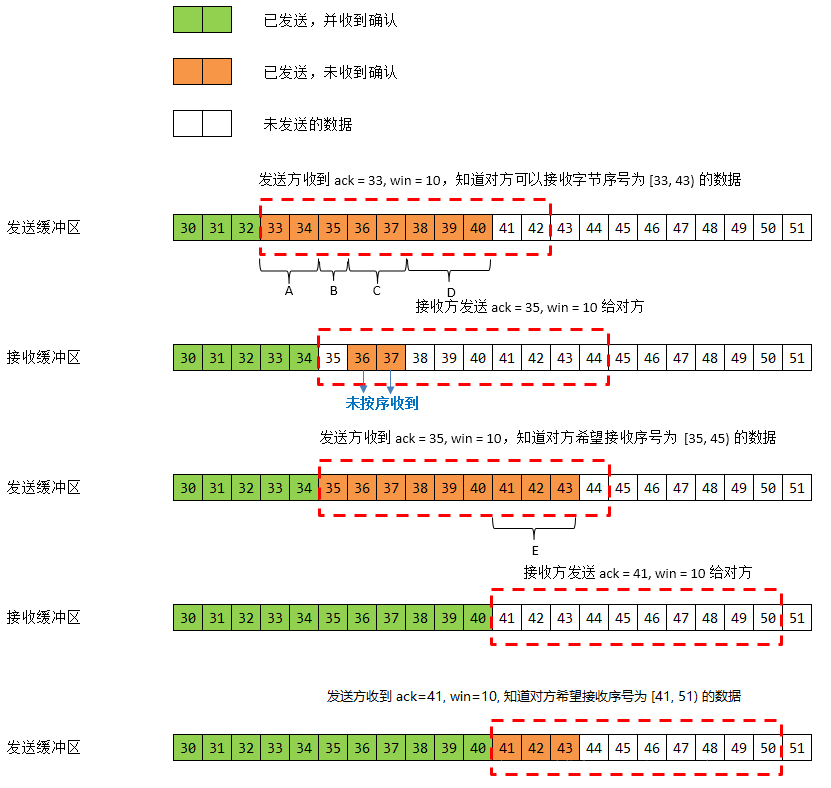
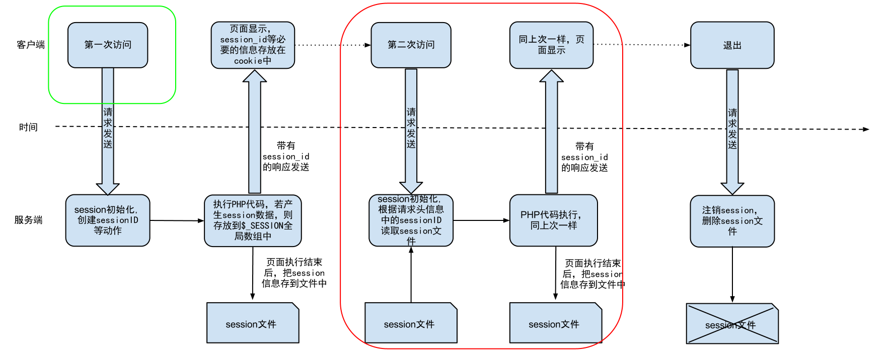

[TOC]

<!-- TOC -->

- [第一部分：传输层](#第一部分传输层)
    - [1. 说一下OSI七层模型 & TCP/IP四层模型 & 五层协议](#1-说一下osi七层模型--tcpip四层模型--五层协议)
        - [1.1 五层协议](#11-五层协议)
        - [1.2 ISO七层模型中表示层和会话层功能是什么？](#12-iso七层模型中表示层和会话层功能是什么)
        - [1.3 数据在各层之间的传递过程](#13-数据在各层之间的传递过程)
        - [1.4 TCP/IP四层模型](#14-tcpip四层模型)
    - [2. TCP报头格式和UDP报头格式](#2-tcp报头格式和udp报头格式)
        - [2.1 UDP 和 TCP 的特点](#21-udp-和-tcp-的特点)
        - [2.2 UDP 首部格式](#22-udp-首部格式)
        - [2.3 TCP 首部格式](#23-tcp-首部格式)
    - [3. TCP三次握手？那四次挥手呢？如何保障可靠传输](#3-tcp三次握手那四次挥手呢如何保障可靠传输)
        - [3.1 三次握手](#31-三次握手)
        - [3.2 三次握手的原因](#32-三次握手的原因)
        - [3.3 四次挥手](#33-四次挥手)
        - [3.4 四次挥手的原因](#34-四次挥手的原因)
        - [3.5 TIME_WAIT](#35-time_wait)
        - [3.6 如何保证可靠传输](#36-如何保证可靠传输)
        - [3.7 为什么TCP连接需要三次握手，两次不可以吗，为什么？【阿里面经OneNote】](#37-为什么tcp连接需要三次握手两次不可以吗为什么阿里面经onenote)
        - [3.8 TCP连接状态？](#38-tcp连接状态)
    - [4. TCP和UDP区别？如何改进TCP【阿里面经OneNote】](#4-tcp和udp区别如何改进tcp阿里面经onenote)
    - [5. TCP滑动窗口？【阿里面经OneNote】](#5-tcp滑动窗口阿里面经onenote)
    - [6. TCP流量控制](#6-tcp流量控制)
    - [7. TCP的拥塞处理（Congestion Handling）【阿里面经OneNote】](#7-tcp的拥塞处理congestion-handling阿里面经onenote)
        - [1. 慢开始与拥塞避免](#1-慢开始与拥塞避免)
        - [2. 快重传与快恢复](#2-快重传与快恢复)
    - [8. 如何区分流量控制和拥塞控制？](#8-如何区分流量控制和拥塞控制)
    - [9. 解释RTO，RTT和超时重传？](#9-解释rtortt和超时重传)
    - [10. 从输入网址到获得页面的网络请求过程【阿里面经OneNote】](#10-从输入网址到获得页面的网络请求过程阿里面经onenote)
    - [11. 什么是短连接和长连接](#11-什么是短连接和长连接)
    - [](#)
- [第二部分：应用层（HTTP）](#第二部分应用层http)
    - [1. URL、URI、URN区别](#1-urluriurn区别)
    - [2. HTTP的请求和响应报文](#2-http的请求和响应报文)
        - [2.1 请求报文](#21-请求报文)
        - [2.2 响应报文](#22-响应报文)
    - [3. HTTP状态](#3-http状态)
        - [1XX 信息](#1xx-信息)
        - [2XX 成功](#2xx-成功)
        - [3XX 重定向](#3xx-重定向)
        - [4XX 客户端错误](#4xx-客户端错误)
        - [5XX 服务器错误](#5xx-服务器错误)
    - [4. HTTP方法](#4-http方法)
        - [GET](#get)
        - [HEAD](#head)
        - [POST](#post)
        - [PUT](#put)
        - [PATCH](#patch)
        - [DELETE](#delete)
        - [OPTIONS](#options)
        - [CONNECT](#connect)
        - [TRACE](#trace)
    - [5. GET和POST的区别？【阿里面经OneNote】](#5-get和post的区别阿里面经onenote)
    - [6. 如何理解HTTP协议是无状态的](#6-如何理解http协议是无状态的)
    - [7. Cookie](#7-cookie)
        - [7.1 用途](#71-用途)
        - [7.2 创建过程](#72-创建过程)
        - [7.3 分类](#73-分类)
        - [7.4 JavaScript 获取 Cookie](#74-javascript-获取-cookie)
        - [7.5 Secure 和 HttpOnly](#75-secure-和-httponly)
        - [7.6 作用域](#76-作用域)
    - [7. Session](#7-session)
    - [8. 浏览器禁用 Cookie](#8-浏览器禁用-cookie)
    - [9. Cookie 与 Session 选择](#9-cookie-与-session-选择)

<!-- /TOC -->


## 第一部分：传输层

### 1. 说一下OSI七层模型 & TCP/IP四层模型 & 五层协议


<div align="center">  </div><br>


#### 1.1 五层协议

- **应用层** ：为特定应用程序提供数据传输服务，例如 HTTP、DNS 等。数据单位为报文。
- **运输层** ：提供的是进程间的通用数据传输服务。由于应用层协议很多，定义通用的运输层协议就可以支持不断增多的应用层协议。运输层包括两种协议：
  - 传输控制协议 TCP，提供面向连接、可靠的数据传输服务，数据单位为报文段；
  - 用户数据报协议 UDP，提供无连接、尽最大努力的数据传输服务，数据单位为用户数据报。
  - TCP 主要提供完整性服务，UDP 主要提供及时性服务。
- **网络层** ：为主机间提供数据传输服务，而运输层协议是为主机中的进程提供服务。网络层把运输层传递下来的报文段或者用户数据报封装成分组。
- **数据链路层** ：网络层针对的还是主机之间的数据传输服务，而主机之间可以有很多链路，链路层协议就是为同一链路的节点提供服务。数据链路层把网络层传来的分组封装成帧。
- **物理层** ：考虑的是怎样在传输媒体上传输数据比特流，而不是指具体的传输媒体。物理层的作用是尽可能屏蔽传输媒体和通信手段的差异，使数据链路层感觉不到这些差异。


#### 1.2 ISO七层模型中表示层和会话层功能是什么？

- **表示层** ：数据压缩、加密以及数据描述。这使得应用程序不必担心在各台主机中表示/存储的内部格式不同的问题。 

- **会话层** ：建立会话，如session认证、断点续传。

  

- 说明：五层协议没有表示层和会话层，而是将这些功能留给应用程序开发者处理。


#### 1.3 数据在各层之间的传递过程

在向下的过程中，需要添加下层协议所需要的首部或者尾部，而在向上的过程中不断拆开首部和尾部。

路由器只有下面三层协议，因为路由器位于网络核心中，不需要为进程或者应用程序提供服务，因此也就不需要运输层和应用层。

<div align="center">  </div><br>


#### 1.4 TCP/IP四层模型

它只有四层，相当于五层协议中**数据链路层和物理层合并为网络接口层**。

现在的 TCP/IP 体系结构不严格遵循 OSI 分层概念，应用层可能会直接使用 IP 层或者网络接口层。


<div align="center">  </div><br>


TCP/IP 协议族是一种沙漏形状，中间小两边大，IP 协议在其中占用举足轻重的地位。 

<div align="center">  </div><br>


### 2. TCP报头格式和UDP报头格式

网络层只把分组发送到目的主机，但是真正通信的并不是主机而是主机中的进程。运输层提供了进程间的逻辑通信，运输层向高层用户屏蔽了下面网络层的核心细节，使应用程序看起来像是在两个运输层实体之间有一条端到端的逻辑通信信道。

#### 2.1 UDP 和 TCP 的特点

- 用户数据报协议 UDP（User Datagram Protocol）是无连接的，尽最大可能交付，没有拥塞控制，面向报文（对于应用程序传下来的报文不合并也不拆分，只是添加 UDP 首部），支持一对一、一对多、多对一和多对多的交互通信。
- 传输控制协议 TCP（Transmission Control Protocol）是面向连接的，提供可靠交付，有流量控制，拥塞控制，提供全双工通信，面向字节流（把应用层传下来的报文看成字节流，把字节流组织成大小不等的数据块），每一条 TCP 连接只能是点对点的（一对一）。

#### 2.2 UDP 首部格式

<div align="center">  </div><br>

首部字段只有 8 个字节，包括源端口、目的端口、长度、检验和。12 字节的伪首部是为了计算检验和临时添加的。


#### 2.3 TCP 首部格式

<div align="center">  </div><br>


- **序号** ：用于对字节流进行编号，例如序号为 301，表示第一个字节的编号为 301，如果携带的数据长度为 100 字节，那么下一个报文段的序号应为 401。*[301,400]为序号301的数据长度，下一个则为401*
- **确认号 ack** ：期望收到的下一个报文段的序号。例如 B 正确收到 A 发送来的一个报文段，序号为 501，携带的数据长度为 200 字节，因此 B 期望下一个报文段的序号为 701，B 发送给 A 的确认报文段中确认号就为 701。
- **数据偏移** ：指的是数据部分距离报文段起始处的偏移量，实际上指的是首部的长度。
- **确认 ACK** ：当 ACK=1 时确认号字段有效，否则无效。TCP 规定，在连接建立后所有传送的报文段都必须把 ACK 置 1。
- **同步 SYN** ：在连接建立时用来同步序号。当 SYN=1，ACK=0 时表示这是一个连接请求报文段。若对方同意建立连接，则响应报文中 SYN=1，ACK=1。
- **终止 FIN** ：用来释放一个连接，当 FIN=1 时，表示此报文段的发送方的数据已发送完毕，并要求释放连接。
- **窗口** ：窗口值作为接收方让发送方设置其发送窗口的依据。之所以要有这个限制，是因为接收方的数据缓存空间是有限的。


### 3. TCP三次握手？那四次挥手呢？如何保障可靠传输


前置知识

```
三次握手：three times handshake；three-way handshake

SYN（Synchronize，译：同步）是该协议中的一个标志位。如果该位被置为1，则表示这个报文是一个请求建立连接的报文。
ACK（Acknowledgement，译：确认）也是该协议的一个标志位。如果该位被置为1，则表示这个报文是一个用于确认的报文。
seq(sequence number，序列号)
ack（Acknowledgement Number，确认编号）
```


#### 3.1 三次握手

<div align="center">  </div><br>


假设 A 为客户端，B 为服务器端。

- 首先 B 处于 LISTEN（监听）状态，等待客户的连接请求。
- A 向 B 发送连接请求报文段，SYN=1，ACK=0，选择一个初始的序号 x。
- B 收到连接请求报文段，如果同意建立连接，则向 A 发送连接确认报文段，SYN=1，ACK=1，确认号为 x+1，同时也选择一个初始的序号 y。
- A 收到 B 的连接确认报文段后，还要向 B 发出确认，确认号为 y+1，序号为 x+1。
- B 收到 A 的确认后，连接建立。


#### 3.2 三次握手的原因

​	第三次握手是为了防止失效的连接请求到达服务器，让服务器错误打开连接。

​	失效的连接请求是指：客户端发送的连接请求在网络中滞留，客户端因为没及时收到服务器端发送的连接确认，因此就重新发送了连接请求。滞留的连接请求并不是丢失，之后还是会到达服务器。如果不进行第三次握手，那么服务器会误认为客户端重新请求连接，然后打开了连接。但是并不是客户端真正打开这个连接，因此客户端不会给服务器发送数据，这个连接就白白浪费了。


#### 3.3 四次挥手

<div align="center">  </div><br>


以下描述不讨论序号和确认号，因为序号和确认号的规则比较简单。并且不讨论 ACK，因为 ACK 在连接建立之后都为 1。

- A 发送连接释放报文段，FIN=1。
- B 收到之后发出确认，此时 TCP 属于半关闭状态，B 能向 A 发送数据但是 A 不能向 B 发送数据。
- 当 B 不再需要连接时，发送连接释放请求报文段，FIN=1。
- A 收到后发出确认，进入 TIME-WAIT 状态，等待 2 MSL 时间后释放连接。
- B 收到 A 的确认后释放连接。

#### 3.4 四次挥手的原因

客户端发送了 FIN 连接释放报文之后，服务器收到了这个报文，就进入了 CLOSE-WAIT 状态。这个状态是为了让服务器端发送还未传送完毕的数据，传送完毕之后，服务器会发送 FIN 连接释放报文。


#### 3.5 TIME_WAIT

```
MSL是Maximum Segment Lifetime英文的缩写，中文可以译为 “报文最大生存时间”，他是任何报文在网络上存在的最长时间，超过这个时间报文将被丢弃。2MSL = 2*2mins = 4mins
```

客户端接收到服务器端的 FIN 报文后进入此状态，此时并不是直接进入 CLOSED 状态，还需要等待一个时间计时器设置的时间 2MSL。这么做有两个理由：

- 确保最后一个确认报文段能够到达。如果 B 没收到 A 发送来的确认报文段，那么就会重新发送连接释放请求报文段，A 等待一段时间就是为了处理这种情况的发生。
- 等待一段时间是为了让本连接持续时间内所产生的所有报文段都从网络中消失，使得下一个新的连接不会出现旧的连接请求报文段。


#### 3.6 如何保证可靠传输

- 应用数据被分割成TCP认为最适合发送的数据块。 
- 超时重传：当TCP发出一个段后，它启动一个定时器，等待目的端确认收到这个报文段。如果不能及时收到一个确认，将重发这个报文段。
- TCP给发送的每一个包进行编号，接收方对数据包进行排序，把有序数据传送给应用层。 
- 校验和：TCP将保持它首部和数据的检验和。这是一个端到端的检验和，目的是检测数据在传输过程中的任何变化。如果收到段的检验和有差错，TCP将丢弃这个报文段和不确认收到此报文段。
- TCP的接收端会丢弃重复的数据。
- 流量控制：TCP连接的每一方都有固定大小的缓冲空间，TCP的接收端只允许发送端发送接收端缓冲区能接纳的我数据。当接收方来不及处理发送方的数据，能提示发送方降低发送的速率，防止包丢失。TCP使用的流量控制协议是可变大小的滑动窗口协议。
- 拥塞控制：当网络拥塞时，减少数据的发送。 


#### 3.7 为什么TCP连接需要三次握手，两次不可以吗，为什么？【阿里面经OneNote】 

**为了防止已失效的连接请求报文段突然又传送到了服务端，占用服务器资源。 （假设主机A为客户端，主机B为服务器端）**

现假定出现一种异常情况，即A发出的第一个连接请求报文段并没有丢失，而是在某些网络节点长时间滞留了，以致延误到连接释放以后的某个时间才到B。本来这是一个已失效的报文段。但是B收到此失效的连接请求报文段后，就误认为是A有发出一次新的连接请求。于是就向A发出确认报文段，同意建立连接。假定不采用三次握手，那么只要B发出确认，新的连接就建立了。

由于现在A并没有发出建立连接的请求，因此不会理睬B的确认，也不会向B发送数据。但B却以为新的运输连接已经建立了，并一直等待A发来数据。B的许多资源就这样白白浪费了。

采用三次握手的办法可以防止上述现象的发生。例如在刚才的情况下，A不会向B的确认发出确认。B由于收不到确认，就知道A并没有要求建立连接。


#### 3.8 TCP连接状态？ 

- CLOSED：初始状态。
- LISTEN：服务器处于监听状态。
- SYN_SEND：客户端socket执行CONNECT连接，发送SYN包，进入此状态。
- SYN_RECV：服务端收到SYN包并发送服务端SYN包，进入此状态。
- ESTABLISH：表示连接建立。客户端发送了最后一个ACK包后进入此状态，服务端接收到ACK包后进入此状态。
- FIN_WAIT_1：终止连接的一方（通常是客户机）发送了FIN报文后进入。等待对方FIN。
- CLOSE_WAIT：（假设服务器）接收到客户机FIN包之后等待关闭的阶段。在接收到对方的FIN包之后，自然是需要立即回复ACK包的，表示已经知道断开请求。但是本方是否立即断开连接（发送FIN包）取决于是否还有数据需要发送给客户端，若有，则在发送FIN包之前均为此状态。
- FIN_WAIT_2：此时是半连接状态，即有一方要求关闭连接，等待另一方关闭。客户端接收到服务器的ACK包，但并没有立即接收到服务端的FIN包，进入FIN_WAIT_2状态。
- LAST_ACK：服务端发动最后的FIN包，等待最后的客户端ACK响应，进入此状态。
- TIME_WAIT：客户端收到服务端的FIN包，并立即发出ACK包做最后的确认，在此之后的2MSL时间称为TIME_WAIT状态。


### 4. TCP和UDP区别？如何改进TCP【阿里面经OneNote】

- TCP和UDP区别 
  - UDP 是无连接的，即发送数据之前不需要建立连接。 
  - UDP 使用尽最大努力交付，即不保证可靠交付，同时也不使用拥塞控制。 
  - UDP 是面向报文的。UDP 没有拥塞控制，很适合多媒体通信的要求。 
  - UDP 支持一对一、一对多、多对一和多对多的交互通信。 
  - UDP 的首部开销小，只有 8 个字节。 
  - TCP 是面向连接的运输层协议。 
  - 每一条 TCP 连接只能有两个端点(endpoint)，每一条 TCP 连接只能是点对点的（一对一）。 
  - TCP 提供可靠交付的服务。 
  - TCP 提供全双工通信。 
  - TCP是面向字节流。   
  - 首部最低20个字节。 
- TCP加快传输效率的方法 
  - 采取一块确认的机制 


### 5. TCP滑动窗口？【阿里面经OneNote】

<div align="center">  </div><br>

窗口是缓存的一部分，用来暂时存放字节流。发送方和接收方各有一个窗口，接收方通过 TCP 报文段中的窗口字段告诉发送方自己的窗口大小，发送方根据这个值和其它信息设置自己的窗口大小。

发送窗口内的字节都允许被发送，接收窗口内的字节都允许被接收。如果发送窗口左部的字节已经发送并且收到了确认，那么就将发送窗口向右滑动一定距离，直到左部第一个字节不是已发送并且已确认的状态；接收窗口的滑动类似，接收窗口左部字节已经发送确认并交付主机，就向右滑动接收窗口。

接收窗口只会对窗口内最后一个按序到达的字节进行确认，例如接收窗口已经收到的字节为 {31, 34, 35}，其中 {31} 按序到达，而 {32, 33} 就不是，因此只对字节 31 进行确认。发送方得到一个字节的确认之后，就知道这个字节之前的所有字节都已经被接收。


**以下进行窗口华东模拟**

在 TCP 中，**滑动窗口是为了实现流量控制**。如果对方发送数据过快，接收方就来不及接收，接收方就需要通告对方，减慢数据的发送。 




- **发送方接收到了对方发来的报文 ack = 33, win = 10，知道对方收到了 33 号前的数据**，现在期望接收 [33, 43) 号数据。发送方连续发送了 4 个报文段假设为 A, B, C, D, 分别携带 [33, 35), [35, 36), [36, 38), [38, 41) 号数据。
- 接收方接收到了报文段 A, C，但是没收到 B 和 D，也就是只收到了 [33, 35) 和 [36, 38) 号数据。接收方发送回对报文段 A 的确认：ack = 35, win = 10。
- 发送方收到了 ack = 35, win = 10，对方期望接收 [35, 45) 号数据。接着发送了一个报文段 E，它携带了 [41, 44) 号数据。
- 接收方接收到了报文段 B: [35, 36), D:[38, 41)，接收方发送对 D 的确认：ack = 41, win = 10. （这是一个累积确认）
- 发送方收到了 ack = 41, win = 10，对方期望接收 [41, 51) 号数据。
- ……
- 需要注意的是，接收方接收 tcp 报文的顺序是不确定的，并非是一定先收到 35 再收到 36，也可能是先收到 36，37，再收到 35.

 

参考资料：

- [20-TCP 协议（滑动窗口——基础） - CSDN博客](https://blog.csdn.net/q1007729991/article/details/70142341)
- [21-TCP 协议（滑动窗口——抓包分析） - CSDN博客](https://blog.csdn.net/q1007729991/article/details/70143062)
- [TCP 的那些事儿（下） | | 酷 壳 - CoolShell](https://coolshell.cn/articles/11609.html)


### 6. TCP流量控制

流量控制是为了控制发送方发送速率，保证接收方来得及接收。

接收方发送的确认报文中的窗口字段可以用来控制发送方窗口大小，从而影响发送方的发送速率。将窗口字段设置为 0，则发送方不能发送数据。


### 7. TCP的拥塞处理（Congestion Handling）【阿里面经OneNote】

如果网络出现拥塞，分组将会丢失，此时发送方会继续重传，从而导致网络拥塞程度更高。因此当出现拥塞时，应当控制发送方的速率。这一点和流量控制很像，但是出发点不同。流量控制是为了让接收方能来得及接收，而拥塞控制是为了降低整个网络的拥塞程度。


<div align="center">  </div><br>

 

TCP 主要通过四种算法来进行拥塞控制：慢开始、拥塞避免、快重传、快恢复。

发送方需要维护一个叫做拥塞窗口（cwnd）的状态变量，注意拥塞窗口与发送方窗口的区别：拥塞窗口只是一个状态变量，实际决定发送方能发送多少数据的是发送方窗口。

为了便于讨论，做如下假设：

- 接收方有足够大的接收缓存，因此不会发生流量控制；
- 虽然 TCP 的窗口基于字节，但是这里设窗口的大小单位为报文段。


 <div align="center">  </div><br>

#### 1. 慢开始与拥塞避免

发送的最初执行慢开始，令 cwnd=1，发送方只能发送 1 个报文段；当收到确认后，将 cwnd 加倍，因此之后发送方能够发送的报文段数量为：2、4、8 ...

注意到慢开始每个轮次都将 cwnd 加倍，这样会让 cwnd 增长速度非常快，从而使得发送方发送的速度增长速度过快，网络拥塞的可能也就更高。设置一个慢启动阈值 ssthresh，当 cwnd >= ssthresh 时，进入拥塞避免，每个轮次只将 cwnd 加 1。

如果出现了超时，则令 ssthresh = cwnd/2，然后重新执行慢开始。

#### 2. 快重传与快恢复

在接收方，要求每次接收到报文段都应该对最后一个已收到的有序报文段进行确认。例如已经接收到 M1 和 M2，此时收到 M4，应当发送对 M2 的确认。

在发送方，如果收到三个重复确认，那么可以知道下一个报文段丢失，此时执行快重传，立即重传下一个报文段。例如收到三个 M2，则 M3 丢失，立即重传 M3。

在这种情况下，只是丢失个别报文段，而不是网络拥塞。因此执行快恢复，令 ssthresh = cwnd/2 ，cwnd = ssthresh，注意到此时直接进入拥塞避免。慢开始和快恢复的快慢指的是 cwnd 的设定值，而不是 cwnd 的增长速率。慢开始 cwnd 设定为 1，而快恢复 cwnd 设定为 ssthresh。


<div align="center">  </div><br>


### 8. 如何区分流量控制和拥塞控制？ 

- 流量控制属于通信双方协商；拥塞控制涉及通信链路全局。

- 流量控制需要通信双方各维护一个发送窗、一个接收窗，对任意一方，接收窗大小由自身决定，发送窗大小由接收方响应的TCP报文段中窗口值确定；拥塞控制的拥塞窗口大小变化由试探性发送一定数据量数据探查网络状况后而自适应调整。

- 实际最终发送窗口 = min{流控发送窗口，拥塞窗口}。

  

### 9. 解释RTO，RTT和超时重传？ 

- 超时重传：发送端发送报文后若长时间未收到确认的报文则需要重发该报文。可能有以下几种情况：
  - 发送的数据没能到达接收端，所以对方没有响应。
  - 接收端接收到数据，但是ACK报文在返回过程中丢失。
  - 接收端拒绝或丢弃数据。
- RTO：从上一次发送数据，因为长期没有收到ACK响应，到下一次重发之间的时间。就是重传间隔。
  - 通常每次重传RTO是前一次重传间隔的两倍，计量单位通常是RTT。例：1RTT，2RTT，4RTT，8RTT......
  - 重传次数到达上限之后停止重传。
- RTT：数据从发送到接收到对方响应之间的时间间隔，即数据报在网络中一个往返用时。大小不稳定。


### 10. 从输入网址到获得页面的网络请求过程【阿里面经OneNote】

- 查询DNS，获取域名对应的IP地址 
  - 浏览器搜索自身的DNS缓存 
  - 搜索操作系统的DNS缓存 
  - 读取本地的HOST文件 
  - 发起一个DNS的系统调用 
    - 宽带运营服务器查看本身缓存 
    - 运营商服务器发起一个迭代DNS解析请求 
- 浏览器获得域名对应的IP地址后，发起HTTP三次握手 
- TCP/IP连接建立起来后，浏览器就可以向服务器发送HTTP请求了 
- 服务器接受到这个请求，根据路径参数，经过后端的一些处理生成HTML页面代码返回给浏览器 
- 浏览器拿到完整的HTML页面代码开始解析和渲染，如果遇到引用的外部[js](http://lib.csdn.net/base/javascript)，CSS,图片等静态资源，它们同样也是一个个的HTTP请求，都需要经过上面的步骤 
- 浏览器根据拿到的资源对页面进行渲染，最终把一个完整的页面呈现给用户 


超详细版本：

[skyline75489/what-happens-when-zh_CN: What-happens-when 的中文翻译](https://github.com/skyline75489/what-happens-when-zh_CN)


### 11. 什么是短连接和长连接

在HTTP/1.0中默认使用短连接。也就是说，客户端和服务器每进行一次HTTP操作，就建立一次连接，任务结束就中断连接。当客户端浏览器访问的某个HTML或其他类型的Web页中包含有其他的Web资源（如JavaScript文件、图像文件、CSS文件等），每遇到这样一个Web资源，浏览器就会重新建立一个HTTP会话。

而从HTTP/1.1起，默认使用长连接，用以保持连接特性。使用长连接的HTTP协议，会在响应头加入这行代码：

```javascript
Connection:keep-alive
```

在使用长连接的情况下，当一个网页打开完成后，客户端和服务器之间用于传输HTTP数据的TCP连接不会关闭，客户端再次访问这个服务器时，会继续使用这一条已经建立的连接。Keep-Alive不会永久保持连接，它有一个保持时间，可以在不同的服务器软件（如Apache）中设定这个时间。实现长连接需要客户端和服务端都支持长连接。

HTTP协议的长连接和短连接，实质上是TCP协议的长连接和短连接。

### 

## 第二部分：应用层（HTTP）

### 1. URL、URI、URN区别

- URI（Uniform Resource Identifier，统一资源标识符）
- URL（Uniform Resource Locator，统一资源定位符）
- URN（Uniform Resource Name，统一资源名称），例如 urn:isbn:0-486-27557-4。

URI 包含 URL 和 URN，目前 WEB 只有 URL 比较流行，所以见到的基本都是 URL。

<div align="center">  </div><br>

### 2. HTTP的请求和响应报文


#### 2.1 请求报文

<div align="center">  </div><br>


**GET请求**
<div align="center">  </div><br>


**POST请求**
<div align="center">  </div><br>


#### 2.2 响应报文


<div align="center">  </div><br>

**200响应**
<div align="center">  </div><br>


**404响应**
<div align="center">  </div><br>


这一次,让我们再深入一点 - HTTP报文 - 掘金
https://juejin.im/post/5a4f782c5188257326469d7c


### 3. HTTP状态

服务器返回的 **响应报文** 中第一行为状态行，包含了状态码以及原因短语，用来告知客户端请求的结果。

| 状态码 | 类别                             | 原因短语                   |
| ------ | -------------------------------- | -------------------------- |
| 1XX    | Informational（信息性状态码）    | 接收的请求正在处理         |
| 2XX    | Success（成功状态码）            | 请求正常处理完毕           |
| 3XX    | Redirection（重定向状态码）      | 需要进行附加操作以完成请求 |
| 4XX    | Client Error（客户端错误状态码） | 服务器无法处理请求         |
| 5XX    | Server Error（服务器错误状态码） | 服务器处理请求出错         |

#### 1XX 信息

- **100 Continue** ：表明到目前为止都很正常，客户端可以继续发送请求或者忽略这个响应。

#### 2XX 成功

- **200 OK**
- **204 No Content** ：请求已经成功处理，但是返回的响应报文不包含实体的主体部分。一般在只需要从客户端往服务器发送信息，而不需要返回数据时使用。
- **206 Partial Content** ：表示客户端进行了范围请求。响应报文包含由 Content-Range 指定范围的实体内容。

#### 3XX 重定向

- **301 Moved Permanently** ：永久性重定向
- **302 Found** ：临时性重定向
- **303 See Other** ：和 302 有着相同的功能，但是 303 明确要求客户端应该采用 GET 方法获取资源。
- 注：虽然 HTTP 协议规定 301、302 状态下重定向时不允许把 POST 方法改成 GET 方法，但是大多数浏览器都会在 301、302 和 303 状态下的重定向把 POST 方法改成 GET 方法。
- **304 Not Modified** ：如果请求报文首部包含一些条件，例如：If-Match，If-Modified-Since，If-None-Match，If-Range，If-Unmodified-Since，如果不满足条件，则服务器会返回 304 状态码。
- **307 Temporary Redirect** ：临时重定向，与 302 的含义类似，但是 307 要求浏览器不会把重定向请求的 POST 方法改成 GET 方法。

#### 4XX 客户端错误

- **400 Bad Request** ：请求报文中存在语法错误。
- **401 Unauthorized** ：该状态码表示发送的请求需要有认证信息（BASIC 认证、DIGEST 认证）。如果之前已进行过一次请求，则表示用户认证失败。
- **403 Forbidden** ：请求被拒绝，服务器端没有必要给出拒绝的详细理由。
- **404 Not Found**

#### 5XX 服务器错误

- **500 Internal Server Error** ：服务器正在执行请求时发生错误。
- **503 Service Unavailable** ：服务器暂时处于超负载或正在进行停机维护，现在无法处理请求。


### 4. HTTP方法

客户端发送的 **请求报文** 第一行为请求行，包含了方法字段。

#### GET

> 获取资源

当前网络请求中，绝大部分使用的是 GET 方法。

#### HEAD

> 获取报文首部

和 GET 方法一样，但是不返回报文实体主体部分。

主要用于确认 URL 的有效性以及资源更新的日期时间等。

#### POST

> 传输实体主体

POST 主要用来传输数据，而 GET 主要用来获取资源。

更多 POST 与 GET 的比较请见第八章。

#### PUT

> 上传文件

由于自身不带验证机制，任何人都可以上传文件，因此存在安全性问题，一般不使用该方法。

```
PUT /new.html HTTP/1.1
Host: example.com
Content-type: text/html
Content-length: 16

<p>New File</p>
```

#### PATCH

> 对资源进行部分修改

PUT 也可以用于修改资源，但是只能完全替代原始资源，PATCH 允许部分修改。

```
PATCH /file.txt HTTP/1.1
Host: www.example.com
Content-Type: application/example
If-Match: "e0023aa4e"
Content-Length: 100

[description of changes]
```

#### DELETE

> 删除文件

与 PUT 功能相反，并且同样不带验证机制。

```
DELETE /file.html HTTP/1.1
```

#### OPTIONS

> 查询支持的方法

查询指定的 URL 能够支持的方法。

会返回 Allow: GET, POST, HEAD, OPTIONS 这样的内容。

#### CONNECT

> 要求在与代理服务器通信时建立隧道

使用 SSL（Secure Sockets Layer，安全套接层）和 TLS（Transport Layer Security，传输层安全）协议把通信内容加密后经网络隧道传输。

```
CONNECT www.example.com:443 HTTP/1.1
```


<div align="center">  </div><br>


#### TRACE

> 追踪路径

服务器会将通信路径返回给客户端。

发送请求时，在 Max-Forwards 首部字段中填入数值，每经过一个服务器就会减 1，当数值为 0 时就停止传输。

通常不会使用 TRACE，并且它容易受到 XST 攻击（Cross-Site Tracing，跨站追踪）。


### 5. GET和POST的区别？【阿里面经OneNote】

> 就下面的找几个点和面试官侃侃而谈即可，不可能全部都记得，想到什么讲什么吧

- GET 被强制服务器支持 
- 浏览器对URL的长度有限制，所以GET请求不能代替POST请求发送大量数据
- GET请求发送数据更小 
- GET请求是不安全的
- GET请求是幂等的 
  - 幂等的意味着对同一URL的多个请求应该返回同样的结果
- POST请求不能被缓存 
- POST请求相对GET请求是「安全」的 
  - 这里安全的含义仅仅是指是非修改信息
- GET用于信息获取，而且是安全的和幂等的
  - 所谓安全的意味着该操作用于获取信息而非修改信息。换句话说，GET 请求一般不应产生副作用。就是说，它仅仅是获取资源信息，就像数据库查询一样，不会修改，增加数据，不会影响资源的状态。

- POST是用于修改服务器上的资源的请求
- 发送包含未知字符的用户输入时，POST 比 GET 更稳定也更可靠 


**引申：说完原理性的问题，我们从表面上来看看GET和POST的区别：**

- GET是从服务器上获取数据，POST是向服务器传送数据。 GET和 POST只是一种传递数据的方式，GET也可以把数据传到服务器，他们的本质都是发送请求和接收结果。只是组织格式和数据量上面有差别，http协议里面有介绍
- GET是把参数数据队列加到提交表单的ACTION属性所指的URL中，值和表单内各个字段一一对应，在URL中可以看到。POST是通过HTTP POST机制，将表单内各个字段与其内容放置在HTML HEADER内一起传送到ACTION属性所指的URL地址。用户看不到这个过程。 因为GET设计成传输小数据，而且最好是不修改服务器的数据，所以浏览器一般都在地址栏里面可以看到，但POST一般都用来传递大数据，或比较隐私的数据，所以在地址栏看不到，能不能看到不是协议规定，是浏览器规定的。
- 对于GET方式，服务器端用Request.QueryString获取变量的值，对于POST方式，服务器端用Request.Form获取提交的数据。 没明白，怎么获得变量和你的服务器有关，和GET或POST无关，服务器都对这些请求做了封装  
- GET传送的数据量较小，不能大于2KB。POST传送的数据量较大，一般被默认为不受限制。但理论上，IIS4中最大量为80KB，IIS5中为100KB。 POST基本没有限制，我想大家都上传过文件，都是用POST方式的。只不过要修改form里面的那个type参数 
- GET安全性非常低，POST安全性较高。 如果没有加密，他们安全级别都是一样的，随便一个监听器都可以把所有的数据监听到。


### 6. 如何理解HTTP协议是无状态的

​	HTTP协议是无状态的（stateless），指的是协议对于事务处理没有记忆能力，服务器不知道客户端是什么状态。也就是说，打开一个服务器上的网页和上一次打开这个服务器上的网页之间没有任何联系。HTTP是一个无状态的面向连接的协议，无状态不代表HTTP不能保持TCP连接，更不能代表HTTP使用的是UDP协议（无连接）。 

​	缺少状态意味着如果后续处理需要前面的信息，则它必须重传，这样可能导致每次连接传送的数据量增大。另一方面，在服务器不需要先前信息时它的应答就较快。 


### 7. Cookie

HTTP 协议是无状态的，主要是为了让 HTTP 协议尽可能简单，使得它能够处理大量事务。HTTP/1.1 引入 Cookie 来保存状态信息。

Cookie 是服务器发送到用户浏览器并保存在本地的一小块数据，它会在浏览器下次向同一服务器再发起请求时被携带并发送到服务器上。它用于告知服务端两个请求是否来自同一浏览器，并保持用户的登录状态。

#### 7.1 用途

- 会话状态管理（如用户登录状态、购物车、游戏分数或其它需要记录的信息）
- 个性化设置（如用户自定义设置、主题等）
- 浏览器行为跟踪（如跟踪分析用户行为等）

Cookie 曾一度用于客户端数据的存储，因为当时并没有其它合适的存储办法而作为唯一的存储手段，但现在随着现代浏览器开始支持各种各样的存储方式，Cookie 渐渐被淘汰。由于服务器指定 Cookie 后，浏览器的每次请求都会携带 Cookie 数据，会带来额外的性能开销（尤其是在移动环境下）。新的浏览器 API 已经允许开发者直接将数据存储到本地，如使用 Web storage API （本地存储和会话存储）或 IndexedDB。

#### 7.2 创建过程

 

服务器发送的响应报文包含 Set-Cookie 首部字段，客户端得到响应报文后把 Cookie 内容保存到浏览器中。

```
HTTP/1.0 200 OK
Content-type: text/html
Set-Cookie: yummy_cookie=choco
Set-Cookie: tasty_cookie=strawberry

[page content]
```

客户端之后对同一个服务器发送请求时，会从浏览器中读出 Cookie 信息通过 Cookie 请求首部字段发送给服务器。

```
GET /sample_page.html HTTP/1.1
Host: www.example.org
Cookie: yummy_cookie=choco; tasty_cookie=strawberry
```

#### 7.3 分类

- 会话期 Cookie：浏览器关闭之后它会被自动删除，也就是说它仅在会话期内有效。
- 持久性 Cookie：指定一个特定的过期时间（Expires）或有效期（max-age）之后就成为了持久性的 Cookie。

```
Set-Cookie: id=a3fWa; Expires=Wed, 21 Oct 2015 07:28:00 GMT;
```

#### 7.4 JavaScript 获取 Cookie

通过 `Document.cookie` 属性可创建新的 Cookie，也可通过该属性访问非 HttpOnly 标记的 Cookie。

```
document.cookie = "yummy_cookie=choco";
document.cookie = "tasty_cookie=strawberry";
console.log(document.cookie);
```

#### 7.5 Secure 和 HttpOnly

标记为 Secure 的 Cookie 只应通过被 HTTPS 协议加密过的请求发送给服务端。但即便设置了 Secure 标记，敏感信息也不应该通过 Cookie 传输，因为 Cookie 有其固有的不安全性，Secure 标记也无法提供确实的安全保障。

标记为 HttpOnly 的 Cookie 不能被 JavaScript 脚本调用。因为跨域脚本 (XSS) 攻击常常使用 JavaScript 的 `Document.cookie`API 窃取用户的 Cookie 信息，因此使用 HttpOnly 标记可以在一定程度上避免 XSS 攻击。

```
Set-Cookie: id=a3fWa; Expires=Wed, 21 Oct 2015 07:28:00 GMT; Secure; HttpOnly
```

#### 7.6 作用域

Domain 标识指定了哪些主机可以接受 Cookie。如果不指定，默认为当前文档的主机（不包含子域名）。如果指定了 Domain，则一般包含子域名。例如，如果设置 Domain=mozilla.org，则 Cookie 也包含在子域名中（如 developer.mozilla.org）。

Path 标识指定了主机下的哪些路径可以接受 Cookie（该 URL 路径必须存在于请求 URL 中）。以字符 %x2F ("/") 作为路径分隔符，子路径也会被匹配。例如，设置 Path=/docs，则以下地址都会匹配：

- /docs
- /docs/Web/
- /docs/Web/HTTP


### 7. Session

除了可以将用户信息通过 Cookie 存储在用户浏览器中，也可以利用 Session 存储在服务器端，存储在服务器端的信息更加安全。

Session 可以存储在服务器上的文件、数据库或者内存中，现在最常见的是将 Session 存储在内存型数据库中，比如 Redis。

使用 Session 维护用户登录的过程如下：

- 用户进行登录时，用户提交包含用户名和密码的表单，放入 HTTP 请求报文中；
- 服务器验证该用户名和密码；
- 如果正确则把用户信息存储到 Redis 中，它在 Redis 中的 ID 称为 Session ID；
- 服务器返回的响应报文的 Set-Cookie 首部字段包含了这个 Session ID，客户端收到响应报文之后将该 Cookie 值存入浏览器中；
- 客户端之后对同一个服务器进行请求时会包含该 Cookie 值，服务器收到之后提取出 Session ID，从 Redis 中取出用户信息，继续之后的业务操作。

应该注意 Session ID 的安全性问题，不能让它被恶意攻击者轻易获取，那么就不能产生一个容易被猜到的 Session ID 值。此外，还需要经常重新生成 Session ID。在对安全性要求极高的场景下，例如转账等操作，除了使用 Session 管理用户状态之外，还需要对用户进行重新验证，比如重新输入密码，或者使用短信验证码等方式。




### 8. 浏览器禁用 Cookie

此时无法使用 Cookie 来保存用户信息，只能使用 Session。除此之外，不能再将 Session ID 存放到 Cookie 中，而是使用 URL 重写技术，将 Session ID 作为 URL 的参数进行传递。


### 9. Cookie 与 Session 选择

- Cookie 只能存储 ASCII 码字符串，而 Session 则可以存取任何类型的数据，因此在考虑数据复杂性时首选 Session；
- Cookie 存储在浏览器中，容易被恶意查看。如果非要将一些隐私数据存在 Cookie 中，可以将 Cookie 值进行加密，然后在服务器进行解密；
- 对于大型网站，如果用户所有的信息都存储在 Session 中，那么开销是非常大的，因此不建议将所有的用户信息都存储到 Session 中。


### -----------------------------------------这是一条整理的分割线----------------------------------------------


### 9. HTTPS加密认证原理


### 10. SSL连接建立过程

图解SSL/TLS协议 - 阮一峰的网络日志
http://www.ruanyifeng.com/blog/2014/09/illustration-ssl.html


### 11. HTTP2.0原理解析


### 17. HTTP和HTTPS的区别【阿里面经OneNote】

- http是HTTP协议运行在TCP之上。所有传输的内容都是明文，客户端和服务器端都无法验证对方的身份。 
- https是HTTP运行在SSL/TLS之上，SSL/TLS运行在TCP之上。所有传输的内容都经过加密，加密采用对称加密，但对称加密的密钥用服务器方的证书进行了非对称加密。此外客户端可以验证服务器端的身份，如果配置了客户端验证，服务器方也可以验证客户端的身份。 
- https协议需要到ca申请证书，一般免费证书很少，需要交费。 
- http是超文本传输协议，信息是明文传输，https 则是具有安全性的ssl加密传输协议 
- http和https使用的是完全不同的连接方式用的端口也不一样,前者是80,后者是443。 
- http的连接很简单,是无状态的 
- HTTPS协议是由SSL+HTTP协议构建的可进行加密传输、身份认证的网络协议 要比http协议安全 


###  


 


## 第三部分：网络安全

### 18. 如果客户端不断的发送请求连接会怎样？【阿里面经OneNote】

- 服务器端回为每个请求创建一个链接，然后向client端发送创建链接时的回复，然后进行等待客户端发送第三次握手数据包，这样会白白浪费资源 
- DDos攻击 （分布式拒绝服务）

简单的说就是想服务器发送链接请求，首先进行 

第一步：客户端向服务器端发送连接请求数据包（1） 

第二步：服务器向客户端回复连接请求数据包（2），然后服务器等待客户端发送tcp/ip链接的第三步数据包(3) 

第三步：如果客户端不向服务器端发送最后一个数据包(3)，则服务器须等待30s到2min中才能将此链接进行关闭。当大量的请求只进行到第二步，而不进行第三步，服务器又大量的资源等待第三个数据包。则造成DDos攻击。 

 

- DDos预防(没有根治的办法，除非不用TCP/IP链接)、 
  - 确保服务器的系统文件是最新版本，并及时更新系统补丁 
  - 关闭不必要的服务 
  - 限制同时打开SYN的半连接数目 
  - 缩短SYN半连接的time out时间 
  - 正确设置防火墙 
  - 禁止对主机的非开放服务的访问 
  - 限制特定IP短地址的访问 
  - 启用防火墙的防DDos的属性 
  - 严格限制对外开放的服务器的向外访问 
  - 运行端口映射程序祸端口扫描程序，要认真检查特权端口和非特权端口。 
  - 认真检查网络设备和主机/服务器系统的日志。只要日志出现漏洞或是时间变更，那这台机器就可能遭到了攻击。 
  - 限制在防火墙外与网络文件共享。这样会给黑客截取系统文件的机会，主机的信息暴露给黑客，无疑是给了对方入侵的机会。 

### 问：那怎么知道连接是恶意的呢？可能是正常连接？【阿里面经OneNote】


### 7. Web攻击基础

##### 跨站脚本攻击XSS

##### 跨站请求伪造CSRF

##### SQL注入攻击

##### 拒绝服务攻击Dos


XSS跨站脚本攻击 - 那一叶随风 - 博客园
https://www.cnblogs.com/phpstudy2015-6/p/6767032.html#_label0


SQL注入攻击


## 第四部分：网络概述


#### 一、计算机网络 

https://www.nowcoder.com/discuss/61958

  **基础部分**  

1.    **TCP报头格式**    
2.    **UDP报头格式**    
3.    TCP/UDP区别（不仅是宏观上的，最好能根据各自的机制讲解清楚）    
4.    HTTP状态码（最好结合使用场景，比如在缓存命中时使用哪个）    
5.    HTTP协议（一些报头字段的作用，如cace-control、keep-alive）    
6.    OSI协议、TCP/IP协议以及每层对应的协议。    
7.    SESSION机制、cookie机制    
8.    TCP三次握手、四次挥手（这个问题真的要回答吐了，不过真的是面试官最喜欢问的，建议每天手撸一遍，而且不只是每次请求的过程，各种FIN_WAIT、TIME_WAIT状态也要掌握）。    
9.    打开网页到页面显示之间的过程（涵盖了各个方面，DNS解析过程，Nginx请求转发、连接建立和保持过程、浏览器内容渲染过程，考虑的越详细越好）。    
10.    http和https区别，https在请求时额外的过程，https是如何保证数据安全的    
11.    IP地址子网划分    
12.    POST和GET区别    
13.    DNS解析过程   

  **深入部分** 

13. TCP如何保证数据的可靠传输的（这个问题可以引申出很多子问题，拥塞控制慢开始、拥塞避免、快重传、滑动窗口协议、停止等待协议、超时重传机制，最好都能掌握） 
14. 地址解析协议ARP 
15. 交换机和路由器的区别


IP地址+端口 = 套接字


## 参考资料

[OSI 七层参考模型-极客学院（4课时，47分钟）](http://www.jikexueyuan.com/course/1400.html)
