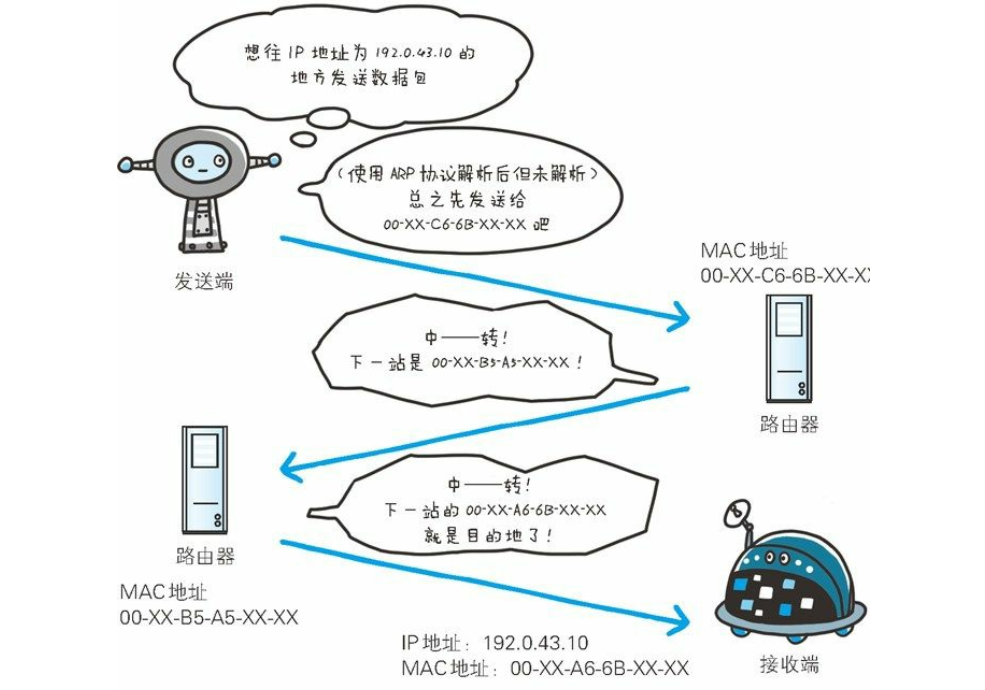

#### 计算机网络

##### 1.说一下OSI七层模型


##### 2.TCP/IP五层模型？


##### 3.TCP和UDP的区别？


##### 4.TCP三次握手？那四次挥手呢？如何保障可靠传输

前置知识：

```
三次握手：three times handshake；three-way handshake

SYN（synchronize，译：同步）是该协议中的一个标志位。如果该位被置为1，则表示这个报文是一个请求建立连接的报文。
ACK（acknowledgement，译：确认）也是该协议的一个标志位。如果该位被置为1，则表示这个报文是一个用于确认的报文。
```


**TCP三次握手过程**




假设 A 为客户端，B 为服务器端。

- 首先 B 处于 LISTEN（监听）状态，等待客户的连接请求。
- A 向 B 发送连接请求报文段，SYN=1，ACK=0，选择一个初始的序号 x。
- B 收到连接请求报文段，如果同意建立连接，则向 A 发送连接确认报文段，SYN=1，ACK=1，确认号为 x+1，同时也选择一个初始的序号 y。
- A 收到 B 的连接确认报文段后，还要向 B 发出确认，确认号为 y+1，序号为 x+1。
- B 收到 A 的确认后，连接建立。


**三次握手的原因**

​	第三次握手是为了防止失效的连接请求到达服务器，让服务器错误打开连接。

​	失效的连接请求是指：客户端发送的连接请求在网络中滞留，客户端因为没及时收到服务器端发送的连接确认，因此就重新发送了连接请求。滞留的连接请求并不是丢失，之后还是会到达服务器。如果不进行第三次握手，那么服务器会误认为客户端重新请求连接，然后打开了连接。但是并不是客户端真正打开这个连接，因此客户端不会给服务器发送数据，这个连接就白白浪费了。


参考：[TCP的三次握手与四次挥手（详解+动图） - CSDN博客](https://blog.csdn.net/qzcsu/article/details/72861891)


5.一个网络请求的过程


